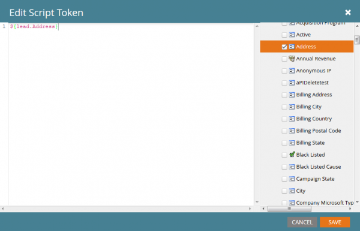
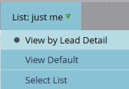

# Scripts de e-mails

Leia o [Guia do usuário do Velocity](https://velocity.apache.org/engine/devel/user-guide.html) para obter uma explicação detalhada do comportamento da linguagem de modelo do Velocity.

[Apache Velocity](https://velocity.apache.org/) é uma linguagem baseada em Java para modelagem e script de conteúdo HTML. Use os tokens de script de email do Velocity in Marketo para acessar dados armazenados em oportunidades e objetos personalizados e criar conteúdo de email dinâmico.

A Velocity fornece o fluxo de controle `if`/`else`, `for` e `foreach` para conteúdo condicional e iterativo.

## Variáveis

Prefixar variáveis com `$`. Criar ou atualizar com `#set`:

```velocity
#set($variable = "value")
```

Recupere valores de variável com tipos de referência que fornecem comportamentos diferentes:

```text
$variable ##outputs 'value'
$variablename ##outputs '$variablename'
${variable}name ##outputs 'valuename'
```


A notação de referência silenciosa inclui `!` após `$`. Por padrão, a Velocity deixa a string de referência no lugar quando uma referência está indefinida. Uma referência silenciosa não emite valor quando está indefinida:

```velocity
##Defined Reference

#set($foo = "bar")
$foo ##outputs "bar"

##Undefined Reference

##normal
$baz ##outputs "$baz"

##quiet
$!baz ##outputs nothing
```

Para obter mais informações sobre como fazer referência a variáveis, consulte o [Guia do Usuário do Apache](https://velocity.apache.org/engine/devel/user-guide.html#formal-reference-notation).

## Ferramentas do Velocity

O projeto Apache Velocity fornece [Ferramentas do Velocity](https://velocity.apache.org/tools/devel/apidocs/overview-summary.html). Esses invólucros expõem métodos de objeto Java por meio de variáveis globais disponíveis para todos os scripts.

- [AlternatorTool](https://velocity.apache.org/tools/devel/apidocs/org/apache/velocity/tools/generic/AlternatorTool.html)
- [FerramentaDataComparação](https://velocity.apache.org/tools/devel/apidocs/org/apache/velocity/tools/generic/ComparisonDateTool.html)
- [FerramentaConversão](https://velocity.apache.org/tools/devel/apidocs/org/apache/velocity/tools/generic/ConversionTool.html)
- [FerramentaData](https://velocity.apache.org/tools/devel/apidocs/org/apache/velocity/tools/generic/DateTool.html)
- [FerramentaExibição](https://velocity.apache.org/tools/devel/apidocs/org/apache/velocity/tools/generic/DisplayTool.html)
- [FerramentaMatemática](https://velocity.apache.org/tools/devel/apidocs/org/apache/velocity/tools/generic/MathTool.html)
- [FerramentaNúmero](https://velocity.apache.org/tools/devel/apidocs/org/apache/velocity/tools/generic/NumberTool.html)
- [EscapeTool](https://velocity.apache.org/tools/devel/apidocs/org/apache/velocity/tools/generic/EscapeTool.html)
- [LoopTool](https://velocity.apache.org/tools/devel/apidocs/org/apache/velocity/tools/generic/LoopTool.html)

Por exemplo, para usar um método de `ComparisonDateTool`, acesse-o a partir da variável `$date` em um token de script:

```velocity
#set($birthday = $convert.parseDate("2015-08-07","yyyy-MM-dd"))
##use whenIs to determine how many days away it is
$date.whenIs($birthday).days ##outputs 1
```

## Criação de um token de script

Adicione scripts do Velocity a emails com tokens de script de email. Crie um token em Atividades de marketing em uma pasta ou programa de marketing.

Para usar um token, o email deve ser secundário ao programa que possui o token ou herdá-lo de uma pasta de marketing. Vá para uma pasta ou programa e selecione a guia [!UICONTROL Meus tokens]. Arraste a opção Script de email do menu direito para a lista de tokens.


Edite o nome do token e selecione [!UICONTROL Clique para Editar] para abrir o editor:


No editor, crie um script que acesse variáveis em objetos acessíveis por script. Para adicionar uma referência de campo de objeto, arraste-a da árvore direita para o script:



## Incorporação e teste do script

Depois de definir o script em um programa Meu token, faça referência a ele por um email no editor de email do Marketo.


Teste o script com a ação [!UICONTROL Enviar Email de Exemplo] no designer de email do Marketo. Selecione um cliente potencial existente no campo [!UICONTROL Cliente Potencial] para que o script seja processado corretamente.

Ao testar `$TriggerObject`, selecione o objeto de disparo com o parâmetro [!UICONTROL Trigger]. O Marketo usa o objeto atualizado mais recentemente desse tipo como a variável `$TriggerObject`.


Você também pode testar com [!UICONTROL Visualização de email]. Selecione **[!UICONTROL Exibir como: Detalhe de Cliente Potencial]** e selecione um cliente potencial em uma lista estática. A visualização também exibe exceções da execução do script:



## Práticas recomendadas

O comprimento combinado de todos os tokens de script de email em um determinado email não pode exceder 100.000 bytes. Esse limite pertence ao comprimento total das próprias cadeias de caracteres do token (não ao comprimento total após a expansão dos tokens).

- As variáveis referenciadas no script de email devem existir no Marketo em um dos objetos disponíveis para o script.
- Você pode fazer referência a objetos personalizados de primeiro e segundo nível que se originam de seu CRM integrado nativamente e que estão diretamente conectados ao cliente potencial ou contato, mas não a objetos personalizados de terceiro nível. Objetos personalizados não podem ser pais do cliente potencial ou da empresa
- Para objetos personalizados do Marketo, você pode fazer referência a objetos personalizados de segundo nível com relacionamento Pai-Filho. Por exemplo `Lead <- Parent <- Child`. Não é possível fazer referência a objetos personalizados de segundo nível com uma relação Edge-Bridge. por exemplo, `Lead <- Bridge -> Edge`
- Você pode fazer referência a objetos personalizados conectados a um cliente potencial, contato ou conta, mas não a mais de um.
- Objetos personalizados só podem ser referenciados por meio de uma única conexão, cliente potencial, contato ou conta
- Marque a caixa no editor de scripts para os campos que você está usando, ou eles não são processados
- Para cada objeto personalizado, os dez registros atualizados mais recentes por pessoa/contato estão disponíveis no tempo de execução. Os registros são ordenados da última atualização no índice 0 para a mais antiga no índice 9. Você pode aumentar o número de registros disponíveis em [seguindo as instruções](https://experienceleague.adobe.com/en/docs/marketo/using/product-docs/administration/email-setup/change-custom-object-retrieval-limits-in-velocity-scripting).
- Se você incluir mais de um script de email em um email, eles serão executados de cima para baixo. O escopo das variáveis definidas no primeiro script a ser executado está disponível nos scripts subsequentes.
- Referência de ferramentas: [https://velocity.apache.org/tools/2.0/index.html](https://velocity.apache.org/tools/2.0/index.html)
- Uma observação sobre tokens que contêm caracteres de nova linha &quot;\n&quot; ou &quot;\r\n&quot;. Quando um email é enviado por meio do Send Sample ou por uma Campanha em lote, os caracteres de nova linha em tokens são substituídos por espaços. Quando o email é enviado por meio do Trigger Campaign, os caracteres de nova linha são deixados intocados.
- Para garantir a análise correta do URL, defina o caminho completo como uma variável e, em seguida, imprima-o. Não imprima variáveis dentro de referências de URL. Inclua o protocolo (`http://` ou `https://`) separadamente do restante da URL. Gerar uma marca de âncora (`<a>`) completa para que os links possam ser rastreados. Os links de saída de um loop `for` ou `foreach` não são rastreados.

```html
<!-- Correct -->
#set($url = "www.example.com/${object.id}")
<a href="http://${url}">Link Text</a>

<!-- Correct -->
<a href="http://www.example.com/${object.id}">Link Text</a>

<!-- Incorrect -->
<a href="${url}">Link Text</a>

<!-- Incorrect -->
<a href="{{my.link}}">Link Text</a>

<!-- Incorrect -->
<a href="http://{{my.link}}">Link Text</a>
```
