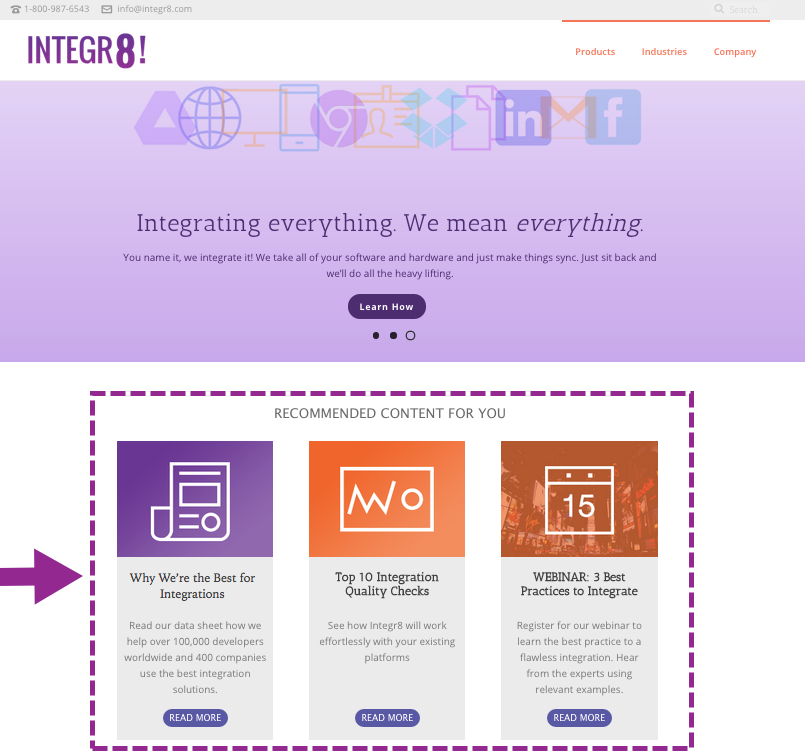

# Recomendação de rich media

Para exibir um modelo de Recomendação de mídia avançada, adicione as tags e chamadas de API necessárias à página.

1. No cabeçalho da página:
   1. Instale a tag RTP.
   1. Adicione a chamada GET que preenche as recomendações.
   1. Adicione a chamada SET que configura o template.
1. No corpo da página:
   1. Coloque a tag de modelo (classe div) onde deseja que o modelo apareça.

Para obter mais informações, consulte [Habilitar Conteúdo Preditivo para Mídia da Web](https://experienceleague.adobe.com/pt-br/docs/marketo/using/product-docs/predictive-content/enabling-predictive-content/enable-predictive-content-for-web-rich-media).

## Tag de modelo

| Atributo | Opcional/Obrigatório | Descrição |
| --- | --- | --- |
| classe | Obrigatório | Identifica o elemento div HTML como uma recomendação RTP div. |
| data-rtp-template-id | Obrigatório | Determina o alinhamento da recomendação. Use &quot;template1&quot; para alinhamento horizontal, &quot;template2&quot; para alinhamento vertical ou &quot;template3&quot; para alinhamento vertical com apenas um título e uma descrição. O script injeta o modelo correspondente neste `div`. Valores admissíveis: template1, template2, template3. |

### Exemplos

Use &quot;template1&quot; para exibir as recomendações horizontalmente.

```html
<div class="RTP_RCMD2" data-rtp-template-id="template1"></div>
```

Use &quot;template2&quot; para exibir as recomendações verticalmente.

```html
<div class="RTP_RCMD2" data-rtp-template-id="template2"></div>
```

Use &quot;template3&quot; para exibir as recomendações verticalmente com apenas um título e uma descrição.

```html
<div class="RTP_RCMD2" data-rtp-template-id="template3"></div>
```

Veja os [exemplos de alinhamento do modelo](#example_of_rich_media_recommendation_template_1).

## Preencher recomendação

Este método preenche toda a mídia avançada `<divs>` da página com recomendações.

### Uso

`rtp('get', 'rcmd', 'richmedia');`

| Parâmetro | Opcional/Obrigatório | Tipo | Descrição |
| --- | --- | --- | --- |
| &#39;get&#39; | Obrigatório | String | Ação do método. |
| &#39;rcmd&#39; | Obrigatório | String | Nome do método. |
| &#39;richmedia&#39; | Obrigatório | String | Nome do submétodo. |

## Alterar configuração do modelo

Esse método altera a configuração do template padrão.

Chame esse método antes de chamar rtp(&#39;get&#39;,&#39;rcmd&#39;, &#39;richmedia&#39;);

### Uso

`rtp('set', 'rcmd', 'richmedia', 'template_id', conf_obj);`

| Parâmetro | Opcional/Obrigatório | Tipo | Descrição |
| --- | --- | --- | --- |
| &#39;definir&#39; | Obrigatório | String | Ação do método. |
| &#39;rcmd&#39; | Obrigatório | String | Nome do método. |
| &#39;richmedia&#39; | Obrigatório | String | Nome do submétodo. |
| template_id | Opcional | String | A ID do modelo das alterações de configuração. Use para especificar alterações de configurações para apenas um modelo. |
| conf_obj | Obrigatório | Objeto | A nova configuração. O objeto mantém todas as configurações como um par de chave/valor. |

### Exemplos

Este exemplo altera o texto do título de um modelo.

```javascript
rtp("set", "rcmd", "richmedia","template1",
    {
        "rcmd.title.text": "RECOMMENDED CONTENT"
    }
);
```

Este exemplo define categorias e várias propriedades de configuração para um modelo.

```javascript
rtp("set", "rcmd", "richmedia",
    {
        "template1":
        {
            "rcmd.title.text": "RECOMMENDED CONTENT",
            "rcmd.general.font.family": "arial",
            "category":
            [
                "webinar",
                "blog posts",
                "pricing_page_category",
                "product_a_category"
            ]
        }
    }
);
```

Use &quot;categoria&quot; para filtrar o conteúdo exibido nas recomendações de conteúdo preditivo. Para usar conteúdo preditivo para todo o conteúdo ativado, deixe a &quot;categoria&quot; vazia.

Para recomendar somente conteúdo específico no modelo Mídia avançada, adicione uma categoria para o conteúdo na página Definir conteúdo. Em seguida, associe essa categoria ao código do template de recomendação. Por exemplo, categorize o conteúdo relevante pelas seções de produto ou solução do seu site.

Este exemplo define várias propriedades de configuração para um modelo.

```javascript
rtp("set", "rcmd", "richmedia",
    {
        "template1":
        {
            "rcmd.title.text": "RECOMMENDED CONTENT",
            "rcmd.general.font.family": "arial"
        }
    }
);
```

#### Propriedades de configuração

| Configuração | Exemplo | Descrição |
| --- | --- | --- |
| rcmd.general.font.family | &quot;rcmd.general.font.family&quot; : &quot;arial&quot; | Altera a família da fonte de todo o texto no modelo. Essa propriedade oferece suporte a todos os valores CSS por tipo de navegador. É possível usar uma família de fontes personalizada se ela existir na página. |
| rcmd.content.background.color | &quot;rcmd.content.background.color&quot; : &quot;black&quot; | Altera a cor do plano de fundo das caixas internas do modelo. Essa propriedade oferece suporte a todos os valores CSS pelo tipo de navegador. |
| rcmd.title.text | &quot;rcmd.title.text&quot; : &quot;CONTEÚDO RECOMENDADO&quot; | Altera o título do modelo. |
| rcmd.title.background.color | &quot;rcmd.title.background.color&quot; : &quot;blue&quot; | Altera a cor do plano de fundo da caixa de título. Essa propriedade oferece suporte a todos os valores de cor css (nome da cor, rgb ...) |
| rcmd.title.font.size | &quot;rcmd.title.font.size&quot; : &quot;26px&quot; | Altera o tamanho da fonte do título. A propriedade oferece suporte a todos os tamanhos de fonte possíveis do valor CSS (px, em, ...) |
| rcmd.title.font.color | &quot;rcmd.title.font.color&quot; : &quot;branco&quot; | Altera a cor da fonte do título. Essa propriedade oferece suporte a todos os valores de cor de fonte (rgb, hex, ...) |
| rcmd.description.font.color | &quot;rcmd.description.font.color&quot; : &quot;branco&quot; | Altera a cor da fonte da descrição. Essa propriedade oferece suporte a todos os valores de cor de fonte (rgb, hex, ...) |
| rcmd.cta.background.color | &quot;rcmd.cta.background.color&quot; : &quot;green&quot; | Altera a cor de fundo do botão. Essa propriedade oferece suporte a todos os valores de cor css (nome da cor, rgb ...) |
| rcmd.cta.font.color | &quot;rcmd.cta.font.color&quot; : &quot;rgb(90, 84, 164)&quot; | Altera a cor da fonte do botão. Essa propriedade oferece suporte a todos os valores de cor de fonte (rgb, hex, ...) |
| rcmd.cta.text | &quot;rcmd.cta.text&quot; : &quot;Push&quot; | Altera o texto do botão. O texto é o mesmo para todos os botões. |
| categoria | &quot;categoria&quot; : [&quot;uma categoria&quot;] | Altera a categoria de recomendação à qual este modelo dá suporte. O modelo exibe somente recomendações com uma das categorias definidas por essa configuração. |

O suporte à configuração pode variar de acordo com o modelo.

#### Exemplo básico

Este exemplo exibe três recomendações em um modelo. Copie o exemplo em uma página do HTML e substitua a tag RTP pela sua tag.

```html
<!DOCTYPE>
<html>
<head>
<meta http-equiv="Content-Type" content="text/html; charset=UTF-8">
<title>RTP recommendation</title>
<!-- RTP tag -->
<script type='text/javascript'>

// This tag needs to be replaced with your account tag
(function(c,h,a,f,i,e){c[a]=c[a]||function(){(c[a].q=c[a].q||[]).push(arguments)};
c[a].a=i;c[a].e=e;var g=h.createElement("script");g.async=true;g.type="text/javascript";
g.src=f+'?aid='+i;var b=h.getElementsByTagName("script")[0];b.parentNode.insertBefore(g,b);
})(window,document,"rtp","//example.rtp.com/rtp-api/v1/rtp.js","account_id");

// Send page view (required by  the recommendation)
rtp('send','view');
// Populate recommendation
rtp('get','rcmd', 'richmedia');
</script>
<!-- End of RTP tag -->
</head>
<body>
<div class="RTP_RCMD2" data-rtp-template-id="template1"></div>
</body>
</html>
```

#### Exemplo avançado

Este exemplo exibe três recomendações em um modelo. O título do modelo é &quot;CONTEÚDO RECOMENDADO&quot; e o texto do botão é &quot;Leia mais&quot;. Copie o exemplo em uma página do HTML e substitua a tag RTP pela sua tag.

```html
<!DOCTYPE>
<html>
<head>
<meta http-equiv="Content-Type" content="text/html; charset=UTF-8">
<title>RTP recommendation</title>
<!-- RTP tag -->
<script type='text/javascript'>

// This tag needs to be replaced with your account tag
(function(c,h,a,f,i,e){c[a]=c[a]||function(){(c[a].q=c[a].q||[]).push(arguments)};
c[a].a=i;c[a].e=e;var g=h.createElement("script");g.async=true;g.type="text/javascript";
g.src=f+'?aid='+i;var b=h.getElementsByTagName("script")[0];b.parentNode.insertBefore(g,b);
})(window,document,"rtp","//example.rtp.com/rtp-api/v1/rtp.js","account_id");

// Send page view (required by  the recommendation)
rtp('send','view');
// Populate the recommendation zone
rtp('get', 'campaign',true);
// Change template configuration
rtp('set', 'rcmd', 'richmedia',
    {
        template1 :
        {
            "rcmd.title.text" : "RECOMMENDED CONTENT",
            "rcmd.cta.text" : "Read More"
        }
    }
);
// Populate recommendation
rtp('get','rcmd', 'richmedia');
</script>
<!-- End of RTP tag -->
</head>
<body>
<div class="RTP_RCMD2" data-rtp-template-id="template1"></div>
</body>
</html>
```

#### Exemplo de modelo de recomendação de mídia avançada #1

**Nome**: modelo1

**Descrição**: conteúdo horizontal que inclui uma imagem, título, descrição e botão do call-to-action.



#### Exemplo de modelo de recomendação de mídia avançada #2

**Nome**: modelo2

**Descrição**: conteúdo vertical que inclui uma imagem, título, descrição e botão do call-to-action.


#### Exemplo de modelo de recomendação de mídia avançada #3

**Nome**: modelo3

**Descrição**: conteúdo vertical que inclui apenas um título e uma descrição. Ao passar o mouse, o cabeçalho muda de cor e de links para o URL do conteúdo. A descrição também vincula ao conteúdo sem alterar a cor.


