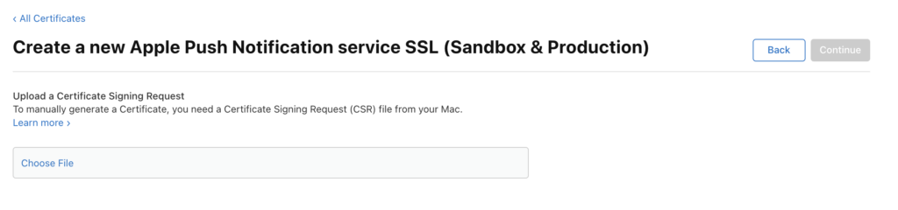

# Notificações por push

Ative notificações por push para aplicativos iOS ou Android que usam o Marketo Mobile SDK.

## Configurar notificação por push no iOS

Há três etapas para ativar as notificações por push:

1. Configure notificações por push em sua conta de desenvolvedor do Apple.
1. Ative notificações por push no xCode.
1. Ative notificações por push no aplicativo com o Marketo SDK.

### Configurar notificações por push na conta de desenvolvedor do Apple

1. Faça logon no Apple Developer [Member Center](https://developer.apple.com/membercenter).
1. Selecione &quot;Certificados, Identificadores e Perfis&quot;.
1. Selecione a pasta &quot;Certificados->Todos&quot; em &quot;iOS, tvOS, watchOS&quot;.
1. Selecione o &quot;+&quot; ao lado dos certificados no canto superior esquerdo. 
1. Selecione &quot;Apple Push Notification service SSL (Sandbox &amp; Produção)&quot; e clique em Continuar.
1. Selecione o identificador de aplicativo usado para compilar o aplicativo.
1. Crie e faça upload de uma CSR para gerar o certificado de push. 
1. Baixe o certificado e clique duas vezes nele para instalar. 
1. Abra &quot;Acesso ao chaveiro&quot;, clique com o botão direito no certificado e exporte ambos os itens para o arquivo `.p12`.
1. Faça upload desse arquivo por meio do Marketo Admin Console para configurar as notificações.
1. Atualizar perfis de provisionamento de aplicativo.

### Ativar notificações por push no xCode

Ative o recurso de notificação por push no projeto xCode.

### Ativar notificações por push no aplicativo com o Marketo SDK

Adicione o seguinte código ao arquivo `AppDelegate.m` para entregar notificações por push a dispositivos clientes.

**Observação** - Se você usar a extensão [!DNL Adobe Launch], use `ALMarketo` como o nome de classe.

Adicionar a seguinte importação a `AppDelegate.h`.

>[!BEGINTABS]

>[!TAB Objetivo C]

```objectivec
#import <UserNotifications/UserNotifications.h>
```

>[!TAB Swift]

```swift
import UserNotifications
```

>[!ENDTABS]

Adicione `UNUserNotificationCenterDelegate` a `AppDelegate` como mostrado abaixo.

>[!BEGINTABS]

>[!TAB Objetivo C]

```objectivec
@interface AppDelegate : UIResponder <UIApplicationDelegate, UNUserNotificationCenterDelegate>
```

>[!TAB Swift]

```swift
class AppDelegate: UIResponder, UIApplicationDelegate , UNUserNotificationCenterDelegate
```

>[!ENDTABS]

Adicione o código a seguir para inicializar o serviço de notificação por push.

>[!BEGINTABS]

>[!TAB Objetivo C]

```objectivec
BOOL)application:(UIApplication *)application didFinishLaunchingWithOptions:(NSDictionary *)launchOptions {
UNUserNotificationCenter *center = [UNUserNotificationCenter currentNotificationCenter];
        center.delegate = self;
        [center requestAuthorizationWithOptions:(UNAuthorizationOptionSound | UNAuthorizationOptionAlert | UNAuthorizationOptionBadge) completionHandler:^(BOOL granted, NSError * _Nullable error){
            if(!error){
                dispatch_async(dispatch_get_main_queue(), ^{
                    [[UIApplication sharedApplication] registerForRemoteNotifications];
                });
            }
        }];

    return YES;
}
```

>[!TAB Swift]

```swift
func application(_ application: UIApplication, didFinishLaunchingWithOptions launchOptions: [UIApplication.LaunchOptionsKey: Any]?) -> Bool {

    UNUserNotificationCenter.current().requestAuthorization(options: [.alert, .sound,    .badge]) { granted, error in
            if let error = error {
                print("\(error.localizedDescription)")
            } else {
                DispatchQueue.main.async {
                    application.registerForRemoteNotifications()
                }
            }
        }

        return true
}
```

>[!ENDTABS]

Chame esse método para iniciar o registro com o Apple Push Service. Se o registro for bem-sucedido, o aplicativo chamará o método `application:didRegisterForRemoteNotificationsWithDeviceToken:` do objeto delegado do aplicativo e passará um token de dispositivo.

Se o registro falhar, o aplicativo chamará o método `application:didFailToRegisterForRemoteNotificationsWithError:` do delegado do aplicativo.

Registre o token de push com o Marketo. O token do dispositivo deve ser registrado para receber notificações por push do Marketo.

>[!BEGINTABS]

>[!TAB Objetivo C]

```objectivec
- (void)application:(UIApplication *)application didRegisterForRemoteNotificationsWithDeviceToken:(NSData *)deviceToken {
    // Register the push token with Marketo
    [[Marketo sharedInstance] registerPushDeviceToken:deviceToken];
}
```

>[!TAB Swift]

```swift
func application(_ application: UIApplication, didRegisterForRemoteNotificationsWithDeviceToken deviceToken: Data) {
    // Register the push token with Marketo
    Marketo.sharedInstance().registerPushDeviceToken(deviceToken)
}
```

>[!ENDTABS]

Também é possível cancelar o registro do token quando o usuário faz logoff.

>[!BEGINTABS]

>[!TAB Objetivo C]

```objectivec
[[Marketo sharedInstance] unregisterPushDeviceToken];
```

>[!TAB Swift]

```swift
Marketo.sharedInstance().unregisterPushDeviceToken
```

>[!ENDTABS]

Para registrar novamente o token de push, extraia o código da etapa 3 em um método AppDelegate. Chame esse método a partir do método de logon ViewController.

Manipule a notificação por push depois de registrar o token do dispositivo no Marketo.

>[!BEGINTABS]

>[!TAB Objetivo C]

```objectivec
- (void)application:(UIApplication *)application didReceiveRemoteNotification:(NSDictionary *)userInfo
{
    [[Marketo sharedInstance] handlePushNotification:userInfo];
}
```

>[!TAB Swift]

```swift
func application(_ application: UIApplication, didReceiveRemoteNotification userInfo: [AnyHashable : Any]) {
    Marketo.sharedInstance().handlePushNotification(userInfo)
}
```

>[!ENDTABS]

Adicione o método a seguir ao AppDelegate.

Use esse método para exibir um alerta, reproduzir um som ou aumentar o selo enquanto o aplicativo está em primeiro plano. Chame o completionHandler apropriado neste método.

>[!BEGINTABS]

>[!TAB Objetivo C]

```objectivec
-(void)userNotificationCenter:(UNUserNotificationCenter *)center
    willPresentNotification:(UNNotification *)notification
        withCompletionHandler:(void (^)(UNNotificationPresentationOptions options))completionHandler{

    completionHandler(UNAuthorizationOptionSound | UNAuthorizationOptionAlert | UNAuthorizationOptionBadge);
}
```

>[!TAB Swift]

```swift
func userNotificationCenter(_ center: UNUserNotificationCenter,
            willPresent notification: UNNotification, withCompletionHandler completionHandler: @escaping (
    UNNotificationPresentationOptions) -> Void) {
    completionHandler([.alert, .sound,.badge])
}
```

>[!ENDTABS]

Lidar com notificações por push recém-recebidas no AppDelegate.

O delegado chama esse método quando o usuário responde a uma notificação abrindo o aplicativo, descartando a notificação ou escolhendo um UNNotificationAction. Defina o delegado antes que o aplicativo retorne de applicationDidFinishLaunching:.

>[!BEGINTABS]

>[!TAB Objetivo C]

```objectivec
- (void)userNotificationCenter:(UNUserNotificationCenter *)center
didReceiveNotificationResponse:(UNNotificationResponse *)response withCompletionHandler:(void(^)(void))completionHandler {
    [[Marketo sharedInstance] userNotificationCenter:center didReceiveNotificationResponse:response withCompletionHandler:completionHandler];
}
```

>[!TAB Swift]

```swift
func userNotificationCenter(_ center: UNUserNotificationCenter,
                                didReceive response: UNNotificationResponse,
                                withCompletionHandler
                                completionHandler: @escaping () -> Void) {
        Marketo.sharedInstance().userNotificationCenter(center, didReceive: response, withCompletionHandler: completionHandler)
}
```

>[!ENDTABS]

Rastrear notificações por push.

Se o aplicativo estiver em segundo plano ou inativo, o dispositivo receberá uma notificação por push, como mostrado abaixo. O Marketo rastreia quando o usuário seleciona a notificação.


Quando o dispositivo recebe uma notificação por push, ele transmite a notificação para o retorno de chamada `application:didReceiveRemoteNotification:` no delegado do aplicativo.

O seguinte log de atividades do Marketo mostra eventos de aplicativo e eventos de notificação por push.


## Configurar notificação por push no Android

1. Adicione as seguintes permissões na tag do aplicativo.

   Abra `AndroidManifest.xml` e adicione as seguintes permissões. Seu aplicativo deve solicitar as permissões &quot;INTERNET&quot; e &quot;ACCESS_NETWORK_STATE&quot;. Ignore esta etapa se o aplicativo já as solicitar.

   ```xml
   <uses‐permission android:name="android.permission.INTERNET"/>
   <uses‐permission android:name="android.permission.ACCESS_NETWORK_STATE"/>
   
   <!‐‐Following permissions are required for push notification.‐‐>
   <uses-permission android:name="android.permission.GET_ACCOUNTS"/>
   <!‐‐Keeps the processor from sleeping when a message is received.‐‐>
   <uses-permission android:name="android.permission.WAKE_LOCK"/>
   <permission android:name="<PACKAGE_NAME>.permission.C2D_MESSAGE" android:protectionLevel="signature" />
   <uses-permission android:name="<PACKAGE_NAME>.permission.C2D_MESSAGE" />
   <!-- This app has permission to register and receive data message. -->
   <uses-permission android:name="com.google.android.c2dm.permission.RECEIVE" />
   ```

1. Configurar o FCM com HTTPv1.

   - Ative o MME FCM HTTPv1 no gerenciador de recursos do Marketo. 
   - Faça upload do arquivo Json da conta de serviço para o aplicativo em MLM.
   - Baixe o arquivo Json da conta de serviço no console do Firebase. 
   - Aguarde uma hora depois de fazer upload do arquivo Json da conta de serviço no Marketo antes de enviar as notificações por push.

## Dispositivos de teste Android

Adicione a atividade Marketo ao arquivo de manifesto dentro da tag do aplicativo.

```xml
<activity android:name="com.marketo.MarketoActivity"  android:configChanges="orientation|screenSize">
    <intent-filter android:label="MarketoActivity">
        <action  android:name="android.intent.action.VIEW"/>
        <category  android:name="android.intent.category.DEFAULT"/>
        <category  android:name="android.intent.category.BROWSABLE"/>
        <data android:host="add_test_device" android:scheme="mkto"/>
    </intent-filter/>
</activity/>
```

## Registrar serviço de push do Marketo

1. Adicione o serviço de mensagens do Firebase a `AndroidManifest.xml` antes de fechar a marca do aplicativo.

   ```xml
   <meta-data
       android:name="com.google.android.gms.version"
       android:value="@integer/google_play_services_version" />
   <service android:name=".MyFirebaseMessagingService">
   <intent-filter>
   <action android:name="com.google.firebase.INSTANCE_ID_EVENT"/>
   <action android:name="com.google.firebase.MESSAGING_EVENT"/>
   </intent-filter>
   </service>
   ```

1. Adicione os métodos do Marketo SDK a `MyFirebaseMessagingService` da seguinte maneira.

   ```java
   import com.marketo.Marketo;
   
   public class MyFirebaseMessagingService extends FirebaseMessagingService {
   
       @Override
       public void onNewToken(String s) {
           super.onNewToken(s);
           Marketo marketoSdk = Marketo.getInstance(this.getApplicationContext());
           marketoSdk.setPushNotificaitonToken(s);
           // Add your code here...
       }
   
       @Override
       public void onMessageReceived(RemoteMessage remoteMessage) {
           Marketo marketoSdk = Marketo.getInstance(this.getApplicationContext());
           marketoSdk.showPushNotificaiton(remoteMessage);
           // Add your code here...
       }
   
   }
   ```

   **Observação** - Se você usar a extensão do Adobe, adicione o seguinte código.

   ```java
   import com.marketo.Marketo;
   
   public class MyFirebaseMessagingService extends FirebaseMessagingService {
   
       @Override
       public void onNewToken(String token) {
           super.onNewToken(token);
           ALMarketo.setPushNotificationToken(token);
           // Add your code here...
       }
   
       @Override
       public void onMessageReceived(RemoteMessage remoteMessage) {
           ALMarketo.showPushNotification(remoteMessage);
           // Add your code here...
       }
   
   }
   ```

**OBSERVAÇÃO**: o FCM SDK adiciona automaticamente as permissões e a funcionalidade do receptor necessárias. Se você usou uma versão anterior do SDK, remova os seguintes elementos obsoletos, o que pode causar duplicação de mensagens.

```xml
<receiver android:name="com.marketo.MarketoBroadcastReceiver" android:permission="com.google.android.c2dm.permission.SEND">
    <intent-filter>
        <!‐‐Receives the actual messages.‐‐>
        <action android:name="com.google.android.c2dm.intent.RECEIVE"/>
        <!‐‐Register to enable push notification‐‐>
        <action android:name="com.google.android.c2dm.intent.REGISTRATION"/>
        <!‐‐‐Replace YOUR_PACKAGE_NAME with your own package name‐‐>
        <category android:name="YOUR_PACKAGE_NAME"/>
    </intent-filter>
</receiver>

<!‐‐Marketo service to handle push registration and notification‐‐>
<service android:name="com.marketo.MarketoIntentService"/>
```

1. Inicializar o Marketo Push. Depois de salvar a configuração, crie ou abra a classe Application e adicione o seguinte código. Obtenha a ID do remetente no Console Firebase.

   ```java
   Marketo marketoSdk = Marketo.getInstance(getApplicationContext());
   
   // Enable push notification here. The push notification channel name can by any string
   marketoSdk.initializeMarketoPush(SENDER_ID,"ChannelName");
   ```

   Se você usar a extensão [!DNL Adobe Launch], use o seguinte código.

   ```java
   // Enable push notification here. The push notification channel name can by any string
   ALMarketo.initializeMarketoPush(SENDER_ID,"ChannelName");
   ```

   Se você não tiver um SENDER_ID, habilite o Serviço de Cloud Messaging do Google completando as etapas detalhadas neste [tutorial](https://developers.google.com/cloud-messaging/).

   Também é possível cancelar o registro do token quando o usuário faz logoff.

   ```java
   marketoSdk.uninitializeMarketoPush();
   ```

   Se você usar a extensão [!DNL Adobe Launch], use o seguinte código.

   ```java
   ALMarketo.uninitializeMarketoPush();
   ```

   Observação: para registrar novamente o token de push, extraia o código da etapa 3 em um método AppDelegate. Chame esse método a partir do método de logon ViewController.

1. Opcional: Defina um ícone de notificação. Chame o método a seguir para configurar um ícone de notificação personalizado.

   ```java
   MarketoConfig.Notification config = new MarketoConfig.Notification();
   // Optional bitmap for honeycomb and above
   config.setNotificationLargeIcon(bitmap);
   
   // Required icon Resource ID
   config.setNotificationSmallIcon(R.drawable.notification_small_icon);
   
   // Set the configuration
   //Use the static methods on ALMarketo class when using Adobe Extension
   Marketo.getInstance(context).setNotificationConfig(config);
   
   // Get the configuration set
   Marketo.getInstance(context).getNotificationConfig();
   ```

## Solução de problemas

Se as mensagens de push móveis não funcionarem como esperado, verifique os problemas comuns de configuração antes de investigar os detalhes da implementação.

### A mensagem de push não está aparecendo

Verifique se as mensagens de push estão desabilitadas no dispositivo. Os usuários móveis podem controlar se recebem mensagens para cada aplicativo, e desenvolvedores ou profissionais de marketing podem desativar mensagens durante o desenvolvimento.

Verifique se o aplicativo está aberto e ativo. Quando o aplicativo está ativo, as mensagens por push móveis não aparecem na tela. Em vez disso, eles aparecem na área &quot;notificações locais&quot; do aplicativo.

### Exibir os logs de atividade no Marketo

Use os logs de atividade do Marketo para verificar se uma mensagem foi enviada.

Revise os registros de atividade para uma pessoa que deveria ter recebido a mensagem. Se a mensagem foi enviada, o log de atividades contém um registro. Se nenhum registro existir, verifique o certificado do iOS ou a configuração da chave da API do Android no Marketo.

### O certificado ou a chave é inválido

Verifique se o certificado correto está carregado para Sandbox ou Produção. Se necessário, exporte novamente os certificados do iOS ou as chaves do Android e recarregue-os no Marketo.

### Um certificado ou uma chave (iOS) está ausente no arquivo .p12

Ao exportar o certificado, exporte a chave e o certificado.

### Provisionamento de perfis desatualizados (iOS)

Depois de adicionar um dispositivo, atualize os perfis de provisionamento e gere novos certificados. Aponte o projeto Xcode para os perfis e certificados corretos e importe os certificados para o Marketo.

### Não é possível carregar o certificado do iOS (IOS)

Verifique se a senha usada para exportar o certificado não contém espaços. Por exemplo, em vez disso:

`Hello World 123`

use isto:

`HelloWorld123`

### Solução de problemas de certificados iOS

Para aplicativos de sandbox, use um certificado &quot;desenvolvedor&quot; ou &quot;universal&quot;. Para aplicativos de produção, carregue um certificado válido de &quot;distribuição&quot; ou &quot;universal&quot;.

### Rejeição por push/token inválido

Um token de registro pode se tornar inválido nos seguintes cenários:

- Se o aplicativo cliente cancelar o registro no GCM.
- Se o aplicativo cliente tiver o registro cancelado automaticamente, o que pode acontecer se o usuário desinstalar o aplicativo. Por exemplo, no iOS, se o Serviço de feedback APNS relatou o token APNS como inválido.
- Se o token de registro expirar. Por exemplo, a Google pode decidir atualizar tokens de registro ou o token APNS expirou para dispositivos iOS.
- Se o aplicativo cliente estiver atualizado, mas a nova versão não estiver configurada para receber mensagens.
