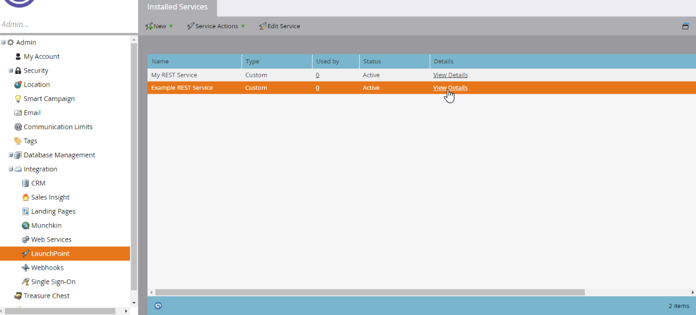

# Autenticação

As APIs REST do Marketo usam OAuth 2.0 com duas pernas para autenticação. Um serviço personalizado fornece a ID do cliente e o Segredo do cliente usados para obter um token de acesso.

Cada serviço personalizado pertence a um usuário somente API. As funções e permissões do usuário autorizam o serviço a executar ações específicas. Um token de acesso pertence a um único serviço personalizado e sua expiração é independente dos tokens de outros serviços personalizados na instância.

## Criação de um token de acesso

Para encontrar o `Client ID` e o `Client Secret`, vá para **[!UICONTROL Admin]** > **[!UICONTROL Integração]** > **[!UICONTROL LaunchPoint]**. Selecione o serviço personalizado e, em seguida, **[!UICONTROL Exibir Detalhes]**.




Para encontrar o `Identity URL`, vá para **[!UICONTROL Admin]** > **[!UICONTROL Integração]** > **[!UICONTROL Serviços da Web]**. O URL aparece na seção API REST.

Criar um token de acesso com uma solicitação HTTP GET ou POST:

```http
GET <Identity URL>/oauth/token?grant_type=client_credentials&client_id=<Client Id>&client_secret=<Client Secret>
```

Se sua solicitação for válida, você receberá uma resposta JSON semelhante à seguinte:

```json
{
    "access_token": "cdf01657-110d-4155-99a7-f986b2ff13a0:int",
    "token_type": "bearer",
    "expires_in": 3599,
    "scope": "apis@acmeinc.com"
}
```

A resposta contém os seguintes campos:

- `access_token`: o token que você passa com as chamadas subsequentes para autenticar com a instância de destino.
- `token_type`: o método de autenticação OAuth.
- `expires_in`: A duração restante do token atual, em segundos. Um novo token de acesso tem uma duração de 3.600 segundos ou uma hora.
- `scope`: o usuário proprietário do serviço personalizado usado para autenticação.

## Uso de um token de acesso

Todas as chamadas à API REST devem incluir um token de acesso em um cabeçalho HTTP.

>[!IMPORTANT]
>
>O suporte para autenticação usando o parâmetro de consulta `access_token` será removido em 31 de agosto de 2026. Se o projeto usar um parâmetro de consulta para passar o token de acesso, ele deverá ser atualizado para usar o [Cabeçalho de autorização](https://experienceleague.adobe.com/en/docs/marketo-developer/marketo/rest/authentication#using-an-access-token) o mais rápido possível. O novo desenvolvimento deve usar o cabeçalho `Authorization` exclusivamente.

### Alternar para o cabeçalho de Autorização

Para substituir o parâmetro de consulta `access_token` por um cabeçalho de Autorização, atualize como a solicitação envia o token.

O exemplo de cURL a seguir envia o valor `access_token` como um parâmetro de formulário com o sinalizador `-F`:

```bash
curl ...  -F access_token=<Access Token> <REST API Endpoint Base URL>/bulk/v1/apiCall.json
```

O exemplo a seguir envia o mesmo valor no cabeçalho HTTP `Authorization: Bearer` com o sinalizador `-H`:

```bash
curl ... -H 'Authorization: Bearer <Access Token>' <REST API Endpoint Base URL>/bulk/v1/apiCall.json
```

## Dicas e práticas recomendadas

Armazene o token de acesso e o período de expiração da resposta de identidade. O gerenciamento da expiração do token ajuda a impedir erros inesperados de autenticação durante a operação normal.

Antes de fazer uma chamada REST, verifique o tempo de vida restante do token. Se o token tiver expirado, renove-o chamando o ponto de extremidade [Identidade](https://developer.adobe.com/marketo-apis/api/identity/#tag/Identity/operation/identityUsingGET). A renovação proativa evita falhas causadas por tokens expirados e torna a latência da chamada REST mais previsível, o que é importante para aplicativos voltados para o usuário final.

Os erros de autenticação retornam os seguintes códigos:

- `602`: O token de acesso expirou.
- `601`: token de acesso inválido.

Se o cliente receber qualquer um dos códigos, renove o token chamando o endpoint de identidade.

Se você chamar o endpoint de identidade antes que o token expire, a resposta retornará o mesmo token e seu tempo de vida restante.

Os tokens de acesso pertencem a serviços personalizados, não a usuários. Se as credenciais de dois serviços diferentes produzirem respostas de identidade com escopo para o mesmo usuário, seus tokens de acesso e períodos de expiração permanecerão independentes.

Quando um aplicativo usa vários conjuntos de credenciais, use a ID do cliente como uma chave para gerenciar cada token independentemente.
