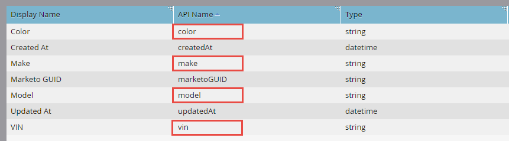

# Importação de Objeto Personalizado em Massa

[Referência de Ponto de Extremidade de Importação de Objeto Personalizado em Massa](https://developer.adobe.com/marketo-apis/api/mapi#tag/Bulk-Import-Custom-Objects)

Use a API em massa para importar grandes números de registros de objetos personalizados de forma assíncrona. Forneça os registros em um arquivo simples delimitado por vírgula, tabulação ou ponto-e-vírgula com menos de 10 MB. Se o arquivo for maior, a API retornará um código de status HTTP 413.

O conteúdo do arquivo depende da definição do objeto personalizado. A primeira linha deve ser um cabeçalho e cada campo de cabeçalho deve corresponder a um nome de API. Cada linha restante contém um registro.

A importação de objetos personalizados em massa oferece suporte somente à operação de registro &quot;inserir ou atualizar&quot;.

## Limites de processamento

Cada solicitação de importação em massa é adicionada como um trabalho a uma fila FIFO (first-in, first-out). São aplicáveis os seguintes limites:

- No máximo dois trabalhos podem ser processados simultaneamente.
- Um máximo de 10 tarefas podem estar na fila, incluindo as duas tarefas que estão sendo processadas.

Se você exceder o máximo de 10 trabalhos, a API retornará um erro `1016, Too many imports`.

## Exemplo de objeto personalizado

Antes de usar a API em massa, use a interface do Administrador do Marketo para [criar seu objeto personalizado](https://experienceleague.adobe.com/en/docs/marketo/using/product-docs/administration/marketo-custom-objects/create-marketo-custom-objects).

Este exemplo usa um objeto personalizado `Car` com campos `Color`, `Make`, `Model` e `VIN`. O campo VIN é usado para desduplicação. As telas da interface do usuário do administrador destacam os nomes de API exigidos pelos endpoints de API em massa.


Estes são os campos de objeto personalizados, conforme apresentados na interface do usuário do administrador.



### Nomes da API

Para recuperar nomes de API programaticamente, passe o nome da API do objeto personalizado para o ponto de extremidade [Descrever Objeto Personalizado](#describe).

```text
/rest/v1/customobjects/{apiName}/describe.json
```

```json
{
    "requestId": "46ff#15a686e66de",
    "result": [
        {
            "name": "car_c",
            "displayName": "Car",
            "description": "It is a car.",
            "createdAt": "2017-02-22T19:55:51Z",
            "updatedAt": "2017-02-22T19:55:51Z",
            "idField": "marketoGUID",
            "dedupeFields": [
                "vin"
            ],
            "searchableFields": [
                [
                    "vin"
                ],
                [
                    "marketoGUID"
                ]
            ],
            "fields": [
                {
                    "name": "createdAt",
                    "displayName": "Created At",
                    "dataType": "datetime",
                    "updateable": false
                },
                {
                    "name": "marketoGUID",
                    "displayName": "Marketo GUID",
                    "dataType": "string",
                    "length": 36,
                    "updateable": false
                },
                {
                    "name": "updatedAt",
                    "displayName": "Updated At",
                    "dataType": "datetime",
                    "updateable": false
                },
                {
                    "name": "color",
                    "displayName": "Color",
                    "dataType": "string",
                    "length": 255,
                    "updateable": true
                },
                {
                    "name": "make",
                    "displayName": "Make",
                    "dataType": "string",
                    "length": 255,
                    "updateable": true
                },
                {
                    "name": "model",
                    "displayName": "Model",
                    "dataType": "string",
                    "length": 255,
                    "updateable": true
                },
                {
                    "name": "vin",
                    "displayName": "VIN",
                    "dataType": "string",
                    "length": 255,
                    "updateable": true
                }
            ]
        }
    ],
    "success": true
}
```

### Importar arquivo

O seguinte arquivo CSV contém três `Car` registros de objeto personalizado:

```text
color,make,model,vin
red,bmw,2002,WBA4R7C55HK895912
yellow,bmw,320i,WBA4R7C30HK896061
blue,bmw,325i,WBS3U9C52HP970604
```

A primeira linha é o cabeçalho. As linhas 2 a 4 contêm os registros de dados do objeto personalizado.

## Criação de um trabalho

Para criar o trabalho de importação em massa, inclua o nome da API do objeto personalizado no caminho para o ponto de extremidade [Importar Objetos Personalizados](https://developer.adobe.com/marketo-apis/api/mapi#tag/Identity/operation/identityUsingPOST). Incluir estes parâmetros:

- `file`: O nome do arquivo de importação.
- `format`: O formato do delimitador de arquivo (`csv`, `tsv` ou `ssv`).

```http
POST /bulk/v1/customobjects/{apiName}/import.json?format=csv
```

```text
Transfer-Encoding: chunked
Content-Type: multipart/form-data; boundary=----WebKitFormBoundaryXjWP6BP8Ciq6bPeo
Content-Length: 290
Host: <munchkinId>.mktorest.com
```

```text
------WebKitFormBoundaryXjWP6BP8Ciq6bPeo
Content-Disposition: form-data; name="file"; filename="custom_object_import.csv"
Content-Type: text/csv

color,make,model,vin
red,bmw,2002,WBA4R7C55HK895912
yellow,bmw,320i,WBA4R7C30HK896061
blue,bmw,325i,WBS3U9C52HP970604
------WebKitFormBoundaryXjWP6BP8Ciq6bPeo--
```

```json
{
    "requestId": "c015#15a68a23418",
    "result": [
        {
            "batchId": 1013,
            "status": "Queued",
            "objectApiName": "car_c"
        }
    ],
    "success": true
}
```

Este exemplo especifica o formato `csv` e nomeia o arquivo de importação `custom_object_import.csv`.

Como a chamada é assíncrona, a resposta contém um `batchId` em vez dos sucessos e falhas individuais retornados pelo ponto de extremidade Sincronizar Objetos Personalizados. O `status` pode ser `Queued`, `Importing` ou `Failed`.

Mantenha o `batchId` para verificar o status da importação e recuperar falhas ou avisos após a conclusão. O `batchId` permanece válido por sete dias.

A seguinte solicitação cURL de linha de comando envia o exemplo de trabalho:

```bash
curl -X POST -i -F format='csv' -F file='@custom_object_import.csv' -F access_token='<Access Token>' <REST API Endpoint URL>/bulk/v1/customobjects/car_c/import.json
```

Neste exemplo, o arquivo `custom_object_import.csv` contém os seguintes dados:

```text
color,make,model,vin
red,bmw,2002,WBA4R7C55HK895912
yellow,bmw,320i,WBA4R7C30HK896061
blue,bmw,325i,WBS3U9C52HP970604
```

## Status do trabalho de pesquisa

Depois de criar o trabalho de importação, sonde-o a cada 5-30 segundos. Passe o nome da API de objeto personalizado e `batchId` no caminho para o ponto de extremidade [Obter Status do Objeto Personalizado de Importação](https://developer.adobe.com/marketo-apis/api/mapi#tag/Bulk-Import-Custom-Objects/operation/getImportCustomObjectStatusUsingGET).

```http
GET /bulk/v1/customobjects/{apiName}/import/{batchId}/status.json
```

```json
{
    "requestId": "2a5#15a68dd9be1",
    "result": [
        {
            "batchId": 1013,
            "operation": "import",
            "status": "Complete",
            "objectApiName": "car_c",
            "numOfObjectsProcessed": 3,
            "numOfRowsFailed": 0,
            "numOfRowsWithWarning": 0,
            "importTime": "2 second(s)",
            "message": "Import succeeded, 3 records imported (3 members)"
        }
    ],
    "success": true
}
```

Esta resposta mostra uma importação concluída. O `status` pode ser `Complete`, `Queued`, `Importing` ou `Failed`.

Quando o job for concluído, a resposta listará o número de linhas processadas, com falha e processadas com avisos. O atributo `message` pode fornecer informações adicionais sobre o trabalho.

## Falhas

O atributo `numOfRowsFailed` na resposta [Obter Status do Objeto Personalizado de Importação](https://developer.adobe.com/marketo-apis/api/mapi#tag/Bulk-Import-Custom-Objects/operation/getImportCustomObjectStatusUsingGET) indica o número de linhas com falha. Um valor maior que zero significa que ocorreram falhas.

Passe o nome da API de objeto personalizado e `batchId` no caminho para o ponto de extremidade [Obter Falhas de Importação de Objeto Personalizado](https://developer.adobe.com/marketo-apis/api/mapi#tag/Bulk-Import-Custom-Objects/operation/getImportCustomObjectFailuresUsingGET). O endpoint retorna um arquivo com detalhes de falha. Se não houver nenhum arquivo com falha, ele retornará um código de status HTTP 404.

Para demonstrar uma falha, modifique o cabeçalho alterando `vin` para ` vin`, adicionando um espaço entre a vírgula e `vin`.

```text
color,make,model, vin
```

Após a reimportação do arquivo, a resposta de status mostra `numRowsFailed`: 3, indicando três falhas.

```http
GET /bulk/v1/customobjects/car_c/import/{batchId}/status.json
```

```json
{
    "requestId": "12260#15a68f491ed",
    "result": [
        {
            "batchId": 1016,
            "operation": "import",
            "status": "Complete",
            "objectApiName": "car_c",
            "numOfObjectsProcessed": 0,
            "numOfRowsFailed": 3,
            "numOfRowsWithWarning": 0,
            "importTime": "1 second(s)",
            "message": "Import completed with errors, 0 records imported (0 members), 3 failed"
        }
    ],
    "success": true
}
```

Chame o endpoint Obter Falhas de Objetos Personalizados de Importação para obter mais informações:

```http
GET /bulk/v1/customobjects/car_c/import/{batchId}/failures.json
```

```text
color,make,model, vin,Import Failure Reason
red,bmw,2002,WBA4R7C55HK895912,missing.dedupe.fields
yellow,bmw,320i,WBA4R7C30HK896061,missing.dedupe.fields
blue,bmw,325i,WBS3U9C52HP970604,missing.dedupe.fields
```

A resposta mostra que o campo de desduplicação `vin` está ausente.

## Avisos

O atributo `numOfRowsWithWarning` na resposta Obter Status do Objeto Personalizado de Importação indica o número de linhas com avisos. Um valor maior que zero significa que ocorreram avisos.

Passe o nome da API de objeto personalizado e `batchId` no caminho para o ponto de extremidade [Obter Avisos de Importação de Objeto Personalizado](https://developer.adobe.com/marketo-apis/api/mapi#tag/Bulk-Import-Custom-Objects/operation/getImportCustomObjectWarningsUsingGET). O endpoint retorna um arquivo com detalhes de aviso. Se nenhum arquivo de aviso existir, ele retornará um código de status HTTP 404.

```http
GET /bulk/v1/customobjects/car_c/import/{batchId}/warnings.json
```
