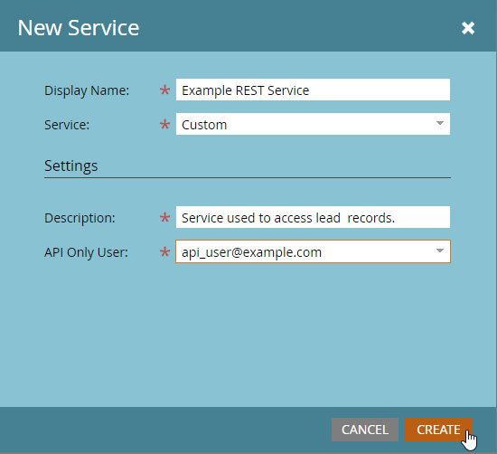

# Serviços personalizados

Um Serviço Personalizado fornece as credenciais usadas para autenticar com o Marketo e obter um token de acesso do [Serviço de Identidade](https://developer.adobe.com/marketo-apis/api/identity/#tag/Identity/operation/identityUsingGET) da Marketo. Cada serviço personalizado tem como escopo um usuário somente API e suas permissões são derivadas desse usuário.

## Funções

Antes de criar um Serviço personalizado, crie uma função para atribuir ao usuário relevante Somente API. Vá para **[!UICONTROL Administrador]** > **[!UICONTROL Usuários e Funções]** > **[!UICONTROL Funções]**.

Funções contêm permissões individuais que permitem ou restringem o acesso a funções específicas. Em assinaturas com Espaços de Trabalho e Partições habilitados, permissões são atribuídas por espaço de trabalho. Um usuário pode executar ações permitidas somente nos espaços de trabalho em que ele tem essas permissões.

Para criar uma função, selecione **[!UICONTROL Nova Função]**.

Dê um nome descritivo à função. Os usuários somente API têm um conjunto específico de permissões separadas das permissões padrão do usuário. As permissões de API aparecem em sua própria hierarquia na árvore &quot;API de acesso&quot;.

### Permissões de função

Somente as permissões no grupo &quot;Access API&quot; se aplicam aos usuários da API. Atribuir todas as permissões de administrador não concede permissões de API a um usuário.

Ao construir uma função, identifique as ações que o aplicativo deve executar. Atribua somente as permissões mínimas necessárias para essas ações. Permissões desnecessárias podem permitir integrações para executar ações indesejadas em sua assinatura.

Use a [ferramenta de permissões](endpoint-reference.md) para determinar o conjunto mínimo de permissões. Veja a lista completa de [permissões](#permission_list).

## Usuários

Depois de criar uma função, crie um usuário &quot;Somente API&quot;. Outros usuários administram usuários somente API, e os usuários somente API não podem fazer logon no Marketo. Eles podem:

- Criar serviços personalizados
- Permissões de escopo para esses serviços
- Acessar APIs REST

>[!MORELIKETHIS]
>
>Para criar um usuário Somente API, vá para o menu **[!UICONTROL Admin]** > **[!UICONTROL Usuários e Funções]** > **[!UICONTROL Usuários]** e selecione **[!UICONTROL Convidar Novo Usuário]**.

Dê ao usuário um nome descritivo e um endereço de email com base no serviço e no aplicativo que usará a conta. O endereço de email não precisa ser válido. Preencha os campos obrigatórios, marque a caixa de seleção **[!UICONTROL Somente API]** e atribua uma de suas funções de API ao usuário. Esta ação atribui o conjunto de permissões da função ao usuário.

Selecione **[!UICONTROL Enviar]** para criar o usuário somente API.

Ao provisionar credenciais para um novo aplicativo, considere criar um usuário separado para o serviço, mesmo se outra integração usar o mesmo conjunto de permissões. As estatísticas e erros de uso de chamadas da API são rastreados por usuário.

Um usuário para cada aplicativo ajuda a isolar o uso e os problemas de aplicativos específicos. Essa separação é útil quando as integrações atingem limites diários de chamada da API ou geram erros de API.

## Serviços personalizados

Os Serviços personalizados fornecem a ID do cliente e o Segredo do cliente necessários para realizar a autenticação com uma instância do Marketo. Para provisionar um serviço, vá para **[!UICONTROL Admin]** > **[!UICONTROL Integrações]** > **[!UICONTROL LaunchPoint]** e selecione **[!UICONTROL Novo Serviço]**.

Dê um nome descritivo ao serviço. Na lista &quot;Serviço&quot;, selecione &quot;Personalizado&quot;. Insira uma descrição detalhada, selecione um usuário apropriado na lista Somente Usuário de API e selecione **[!UICONTROL Criar]**.

O serviço é exibido na lista de serviços do LaunchPoint com uma opção &quot;Exibir detalhes&quot;. Selecione &quot;Exibir detalhes&quot; para acessar a ID do cliente, o segredo do cliente, o usuário proprietário e a opção Obter token.

Use Obter token para testes de curto prazo. O token tem a mesma duração dos tokens obtidos do [Serviço de identidade](https://developer.adobe.com/marketo-apis/api/identity/#tag/Identity/operation/identityUsingGET) e é válido por 3.600 segundos após a criação.

## Espaços de trabalho e partições

Em assinaturas com Espaços de Trabalho e Partições, as permissões de função de um usuário em um espaço de trabalho determinam o acesso a registros e ativos. Cada espaço de trabalho tem acesso a uma ou mais partições e cada lead pertence a uma partição.

Se um usuário somente de API puder ler ou gravar registros de lead em um espaço de trabalho, ele poderá acessar todos os registros nas partições disponíveis para esse espaço de trabalho.

O Assets pertence a espaços de trabalho. Um usuário pode ler ou gravar um ativo quando ele tem uma função com a permissão necessária no espaço de trabalho do ativo.

## Lista de permissões

A tabela a seguir lista as permissões disponíveis para usuários Somente API e o acesso que cada permissão concede.

| Permissão de Função | Concede acesso a... |
| --- | --- |
| Aprovar ativos | Aprovar ativos |
| Executar campanha | Solicitar ou agendar uma campanha |
| Atividade somente de leitura | Recuperar atividades de clientes potenciais |
| Metadados de atividade somente de leitura | Recuperar metadados de atividade de cliente potencial |
| Ativos somente de leitura | Recuperar detalhes do ativo |
| Campanha somente de leitura | Recuperar detalhes da campanha |
| Empresa somente de leitura | Recuperar detalhes da empresa |
| Objeto personalizado somente de leitura | Recuperar detalhes do objeto personalizado |
| Lead somente de leitura | Recuperar detalhes do cliente potencial |
| Conta nomeada somente de leitura | Recuperar detalhes da conta nomeada |
| Lista de contas nomeadas somente de leitura | Recuperar detalhes da lista de contas nomeadas |
| Oportunidade somente de leitura | Recuperar detalhes da oportunidade |
| Pessoa de vendas somente de leitura | Recuperar detalhes do vendedor |
| Atividade de leitura-gravação | Recuperar e criar atividades de cliente potencial |
| Metadados de atividade de leitura e gravação | Recuperar e criar metadados de atividade de cliente potencial |
| Ativos de leitura-gravação | Recuperar, criar e atualizar ativos |
| Campanha de leitura-gravação | Recuperar, criar e atualizar campanhas |
| Empresa de leitura-gravação | Recuperar, criar e atualizar empresas |
| Objeto personalizado de leitura-gravação | Recuperar, criar e atualizar objetos personalizados |
| Lead de leitura-gravação | Recuperar, criar e atualizar detalhes do cliente potencial |
| Conta nomeada de leitura e gravação | Recuperar, criar e atualizar contas nomeadas |
| Lista de contas nomeadas de leitura e gravação | Recuperar, criar e atualizar listas de contas nomeadas |
| Oportunidade de leitura-gravação | Recuperar, criar e atualizar oportunidades |
| Pessoa de vendas de leitura-gravação | Recuperar, criar e atualizar vendedores |
