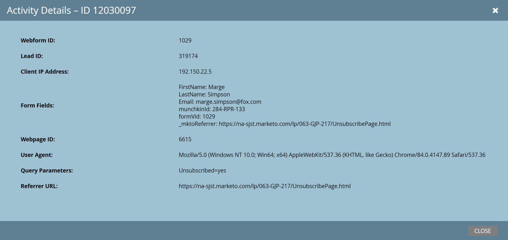

# Leads

[Referência de Ponto de Extremidade de Clientes Potenciais](https://developer.adobe.com/marketo-apis/api/mapi#tag/Leads)

A API de clientes potenciais da Marketo é compatível com operações CRUD em registros de clientes potenciais. Você também pode modificar a associação de um lead em listas e programas estáticos e iniciar o processamento do Smart Campaign para leads.

## Descrever

Use Descrever clientes em potencial para recuperar os campos disponíveis por meio da API REST e os metadados de cada campo:

- Tipo de dados
- Nome da API REST
- Comprimento, se aplicável
- Status somente leitura
- Rótulo amigável

Descrever é a principal fonte da verdade para a disponibilidade de campo e os metadados.

### Solicitação

```http
GET /rest/v1/leads/describe.json
```

### Resposta

```json
{
   "requestId":"37ca#1475b74e276",
   "success":true,
   "result":[
      {
         "id":2,
         "displayName":"Company Name",
         "dataType":"string",
         "length":255,
         "rest":{
            "name":"company",
            "readOnly":false
         },
         "soap":{
            "name":"Company",
            "readOnly":false
         }
      }
}
```

As respostas reais incluem mais campos na matriz de resultados. Cada item representa um campo disponível no registro de cliente potencial e contém pelo menos uma id, um displayName e um tipo de dados.

Os objetos filho rest e soap aparecem somente quando o campo é válido para a API correspondente. A propriedade `readOnly` indica se a API correspondente pode atualizar o campo. Quando presente, a propriedade length fornece o comprimento máximo do campo e a propriedade dataType fornece o tipo de dados do campo.

## Consultar

Use um dos dois métodos principais para recuperar leads:

- Obter lead por ID pega uma id de lead como parâmetro de caminho e retorna um registro de lead.
- Obter Clientes Potenciais por Tipo de Filtro localiza registros cujo campo selecionado corresponde a um dos valores fornecidos.

Para Obter lead por ID, você pode passar um parâmetro de campos com uma lista separada por vírgulas de nomes de campos para retornar. Se a solicitação omitir campos, a resposta incluirá `email`, `updatedAt`, `createdAt`, `lastName`, `firstName` e `id`. Se um campo solicitado não for retornado, seu valor será considerado nulo.

### Solicitação

```http
GET /rest/v1/lead/{id}.json
```

### Resposta

```json
{
   "requestId": "10226#14d3049e51b",
   "success": true,
   "result": [
      {
         "id": 318581,
         "updatedAt":"2015-05-07T11:47:30-08:00"
         "lastName": "Doe",
         "email": "jdoe@marketo.com",
         "createdAt": "2015-05-01T16:47:30-08:00",
         "firstName": "John"
      }
   ]
}
```

Obter lead por ID sempre retorna um registro na primeira posição da matriz de resultados.

Obter clientes em potencial por tipo de filtro retorna o mesmo tipo de registro e pode retornar até 300 registros por página. Os parâmetros de consulta `filterType` e `filterValues` são obrigatórios.

`filterType` aceita qualquer campo personalizado e os campos usados com mais frequência. Chame o ponto de extremidade `Describe2` para recuperar os campos pesquisáveis permitidos para `filterType`. Ao pesquisar por Campo Personalizado, os tipos de dados aceitos são `string`, `email` e `integer`. Use o método Descrever para recuperar detalhes do campo, como descrição e tipo.

`filterValues` aceita até 300 valores separados por vírgulas. A chamada retorna registros em que o campo de lead selecionado corresponde a um desses valores. Se mais de 1.000 leads corresponderem ao filtro, a API retornará &quot;1003, Muitos resultados correspondem ao filtro&quot;.

Se o total de solicitações GET exceder 8 KB, a API retornará &quot;414, URI muito longo&quot; na RFC 7231. Para contornar esse limite, altere GET para POST, adicione o parâmetro _method=GET e coloque a sequência de consulta no corpo da solicitação.

### Solicitação

```http
GET /rest/v1/leads.json?filterType=id&filterValues=318581,318592
```

### Resposta

```json
{
    "requestId": "12951#15699db5c97",
    "result": [
        {
            "id": 318581,
            "updatedAt": "2016-05-17T22:11:45Z",
            "lastName": "Lincoln",
            "email": "abe@usa.gov",
            "createdAt": "2015-03-17T00:18:40Z",
            "firstName": "Abraham"
        },
        {
            "id": 318592,
            "updatedAt": "2016-05-17T22:20:51Z",
            "lastName": "Washington",
            "email": "george@usa.gov",
            "createdAt": "2015-04-06T16:29:21Z",
            "firstName": "George"
        }
    ],
    "success": true
}
```

Esta chamada retorna registros cujas ids correspondem aos valores em `filterValues`.

Se nenhum registro for correspondente, a resposta indicará sucesso e conterá uma matriz de resultados vazia.

### Resposta

```json
{
"requestId": "177a1#1578b643357",
"result": [],
"success": true
}
```

Ambos Obter lead por ID e Obter leads por tipo de filtro aceitam um parâmetro de consulta de campos que contém uma lista de campos de API separados por vírgulas. Quando os campos estão presentes, cada registro de resposta inclui os campos listados. Se for omitida, a resposta incluirá `id`, `email`, `updatedAt`, `createdAt`, `firstName` e `lastName`.

## ADOBE ECID

Quando o Compartilhamento de público-alvo da Adobe Experience Cloud está ativado, a sincronização de cookies associa os valores da Adobe Experience Cloud ID (ECID) aos clientes potenciais da Marketo. Para recuperar valores de ECID associados aos métodos de recuperação de lead anteriores, inclua `ecids` no parâmetro fields. Por exemplo, `&fields=email,firstName,lastName,ecids`.

## Criar e atualizar

A API de clientes potenciais pode criar, atualizar e excluir registros de clientes potenciais. As operações de criação e atualização usam o mesmo ponto de extremidade, com o tipo de operação definido na solicitação. Uma solicitação pode criar ou atualizar até 300 registros.

>[!NOTE]
>
> Não há suporte para a atualização de campos da Empresa usando o ponto de extremidade [Clientes Potenciais de Sincronização](https://developer.adobe.com/marketo-apis/api/mapi#tag/Leads/operation/syncLeadUsingPOST). Em vez disso, use o ponto de extremidade [Sincronizar Empresas](https://developer.adobe.com/marketo-apis/api/mapi#tag/Companies/operation/syncCompaniesUsingPOST).

>[!NOTE]
>
> Ao criar ou atualizar o valor de email em um registro de Pessoa, somente caracteres ASCII são suportados no campo de endereço de email.

### Solicitação

```http
POST /rest/v1/leads.json
```

### Corpo

```json
{
   "action":"createOnly",
   "lookupField":"email",
   "input":[
      {
         "email":"kjashaedd-1@klooblept.com",
         "firstName":"Kataldar-1",
         "postalCode":"04828"
      },
      {
         "email":"kjashaedd-2@klooblept.com",
         "firstName":"Kataldar-2",
         "postalCode":"04828"
      },
      {
         "email":"kjashaedd-3@klooblept.com",
         "firstName":"Kataldar-3",
         "postalCode":"04828"
      }
   ]
}
```

### Resposta

```json
{
   "requestId":"e42b#14272d07d78",
   "success":true,
   "result":[
      {
         "id":50,
         "status":"created"
      },
      {
         "id":51,
         "status":"created"
      },
      {
         "id":52,
         "status":"created"
      }
   ]
}
```

A solicitação usa dois campos importantes:

- `action` especifica o tipo de operação: `createOrUpdate`, `createOnly`, `updateOnly` ou `createDuplicate`. Se omitido, o padrão será `createOrUpdate`.
- `lookupField` especifica a chave quando a ação é `createOrUpdate` ou `updateOnly`. Se omitido, o padrão será `email`.

Por padrão, a operação usa a partição padrão. O parâmetro `partitionName` opcional funciona somente quando a ação é `createOnly` ou `createOrUpdate`. Para usar `partitionName` como critério de desduplicação adicional, inclua-o no tipo de origem para regras de desduplicação personalizadas.

Durante uma atualização, a API retornará um erro se o lead não existir na partição especificada ou se o usuário somente da API não puder acessar essa partição.

Como `id` é uma chave exclusiva gerenciada pelo sistema, inclua-a somente com a ação `updateOnly`.

A solicitação deve incluir um parâmetro `input` contendo uma matriz de registros de cliente potencial. Cada registro de lead é um objeto JSON com qualquer número de campos de lead. As chaves devem ser exclusivas em cada registro e todas as cadeias de caracteres JSON devem usar a codificação UTF-8.

Usar `externalCompanyId` para vincular um registro de cliente potencial a um registro de empresa. Use `externalSalesPersonId` para vincular um registro de cliente potencial a um registro de vendedor.

Solicitações de substituição simultâneas ou cronometradas de perto podem criar registros duplicados quando várias solicitações usam o mesmo valor de chave antes que a primeira solicitação retorne. Para evitar duplicatas, use `createOnly` ou `updateOnly` conforme apropriado. Como alternativa, enfileire chamadas e aguarde até que cada chamada retorne antes de enviar outra substituição com a mesma chave.

## Campos

O objeto de cliente potencial contém campos padrão e campos personalizados opcionais. Existem campos padrão em cada assinatura do Marketo Engage, enquanto os usuários criam campos personalizados conforme necessário.

Cada definição de campo contém atributos de metadados, como nome de exibição, nome da API e dataType.

Use os pontos de extremidade a seguir para consultar, criar e atualizar campos no objeto do cliente potencial. A função do usuário da API deve ter a permissão Campo padrão do esquema de leitura-gravação, a permissão Campo personalizado do esquema de leitura-gravação ou ambas.

## Campos de consulta

Consultar um campo de cliente potencial por nome de API ou consultar todos os campos de cliente potencial. Dependendo das permissões de função, a resposta pode incluir campos padrão, campos personalizados e campos ocultos.

## Por nome

O ponto de extremidade Obter campo de cliente potencial por nome recupera metadados de um campo de cliente potencial. O parâmetro de caminho fieldApiName necessário especifica o nome da API do campo.

A resposta é semelhante à resposta Descrever lead, mas inclui metadados adicionais. Por exemplo, o atributo isCustom indica se o campo é personalizado.

### Solicitação

```http
GET /rest/v1/leads/schema/fields/{fieldApiName}.json
```

### Resposta

```json
{
    "requestId": "cd97#1793ee0fec4",
    "result": [
        {
            "displayName": "Email Address",
            "name": "email",
            "description": null,
            "dataType": "email",
            "length": 255,
            "isHidden": false,
            "isHtmlEncodingInEmail": true,
            "isSensitive": true,
            "isCustom": false
        }
    ],
    "success": true
}
```

## Navegar

O ponto de extremidade Obter campos de cliente potencial recupera metadados para todos os campos no objeto de cliente potencial. Por padrão, retorna no máximo 300 registros. Use o parâmetro de consulta `batchSize` para reduzir esse número.

Se `moreResult` for verdadeiro, mais resultados estarão disponíveis. Passar o `nextPageToken` retornado em cada chamada subsequente até `moreResult` ser falso.

### Solicitação

```http
GET /rest/v1/leads/schema/fields.json
```

### Resposta (Truncada)

```json
{
    "requestId": "142c3#1793eb976d8",
    "result": [
        {
            "displayName": "Salutation",
            "name": "salutation",
            "description": null,
            "dataType": "string",
            "length": 255,
            "isHidden": false,
            "isHtmlEncodingInEmail": true,
            "isSensitive": true,
            "isCustom": false
        },
        {
            "displayName": "First Name",
            "name": "firstName",
            "description": null,
            "dataType": "string",
            "length": 255,
            "isHidden": false,
            "isHtmlEncodingInEmail": true,
            "isSensitive": true,
            "isCustom": false
        },
        {
            "displayName": "Middle Name",
            "name": "middleName",
            "description": null,
            "dataType": "string",
            "length": 255,
            "isHidden": false,
            "isHtmlEncodingInEmail": true,
            "isSensitive": true,
            "isCustom": false
        },
        {
            "displayName": "Last Name",
            "name": "lastName",
            "description": null,
            "dataType": "string",
            "length": 255,
            "isHidden": false,
            "isHtmlEncodingInEmail": true,
            "isSensitive": true,
            "isCustom": false
        },
        {
            "displayName": "Date of Birth",
            "name": "dateOfBirth",
            "description": null,
            "dataType": "date",
            "isHidden": false,
            "isHtmlEncodingInEmail": false,
            "isSensitive": true,
            "isCustom": false
        },
        {
            "displayName": "Email Address",
            "name": "email",
            "description": null,
            "dataType": "email",
            "length": 255,
            "isHidden": false,
            "isHtmlEncodingInEmail": true,
            "isSensitive": true,
            "isCustom": false
        },
        {
            "displayName": "Phone Number",
            "name": "phone",
            "description": null,
            "dataType": "phone",
            "length": 255,
            "isHidden": false,
            "isHtmlEncodingInEmail": true,
            "isSensitive": true,
            "isCustom": false
        },
        {
            "displayName": "Mobile Phone Number",
            "name": "mobilePhone",
            "description": null,
            "dataType": "phone",
            "length": 255,
            "isHidden": false,
            "isHtmlEncodingInEmail": true,
            "isSensitive": true,
            "isCustom": false
        },
        {
            "displayName": "Fax Number",
            "name": "fax",
            "description": null,
            "dataType": "phone",
            "length": 255,
            "isHidden": false,
            "isHtmlEncodingInEmail": true,
            "isSensitive": true,
            "isCustom": false
        },
        {
            "displayName": "Job Title",
            "name": "title",
            "description": null,
            "dataType": "string",
            "length": 255,
            "isHidden": false,
            "isHtmlEncodingInEmail": true,
            "isSensitive": true,
            "isCustom": false
        },
        {
            "displayName": "Unsubscribed",
            "name": "unsubscribed",
            "description": null,
            "dataType": "boolean",
            "isHidden": false,
            "isHtmlEncodingInEmail": false,
            "isSensitive": true,
            "isCustom": false
        },
        ...
    ],
    "success": true,
    "moreResult": false
}
```

## Criar campos

O ponto de extremidade Criar campos de cliente potencial cria um ou mais campos personalizados no objeto de cliente potencial e fornece funcionalidade comparável à interface do usuário do Marketo Engage. Você pode criar até 100 campos personalizados com esse endpoint.

Considere cuidadosamente cada campo antes de criá-lo em uma instância de produção. Depois que um campo é criado, você pode ocultá-lo, mas não pode excluí-lo. Campos não utilizados adicionam desordem à instância.

O parâmetro de entrada necessário é uma matriz de objetos de campo de cliente potencial. Cada objeto requer estes atributos:

- `displayName` é o nome de exibição da interface do usuário do campo.
- `name` é o nome da API do campo.
- `dataType` é o tipo de campo.

Os atributos opcionais são `description`, `isHidden`, `isHtmlEncodingInEmail` e `isSensitive`.

O atributo name deve ser exclusivo, começar com uma letra e conter apenas letras, números ou sublinhados. O `displayName` deve ser exclusivo e não pode conter caracteres especiais.

Uma convenção comum aplica camel case a `displayName` para produzir nome. Por exemplo, um `displayName` de &quot;Meu campo personalizado&quot; produz um nome de &quot;myCustomField&quot;.

### Solicitação

```http
POST /rest/v1/leads/schema/fields.json
```

### Corpo

```json
{
  "input": [
      {
        "displayName": "Acme Access Code",
        "name": "acmeAccessCode",
        "description": "Acme Direct Mail Integration",
        "dataType": "string"
      },
      {
        "displayName": "Acme Mail Date",
        "name": "acmeMailDate",
        "description": "Acme Direct Mail Integration",
        "dataType": "string"
      }
  ]
}
```

### Resposta

```json
{
    "requestId": "d9f1#17943666811",
    "result": [
        {
            "name": "acmeAccessCode",
            "status": "created"
        },
        {
            "name": "acmeMailDate",
            "status": "created"
        }
    ],
    "success": true
}
```

## Atualizar campo

O ponto de extremidade Atualizar campo de cliente potencial atualiza um campo personalizado no objeto de cliente potencial. A maioria das atualizações de campo disponíveis na interface do usuário do Marketo Engage também está disponível por meio da API. A tabela a seguir resume as diferenças.

<table>
<tbody>
<tr>
<td style="width: 26.5306%;" rowspan="2"><strong>Atributo</strong></td>
<td style="width: 35%;" colspan="2"><strong>Campo Padrão</strong></td>
<td style="width: 38.2654%;" colspan="2"><strong>Campo personalizado</strong></td>
</tr>
<tr>
<td style="width: 17.449%;"><strong>Atualizável por API?</strong></td>
<td style="width: 17.551%;"><strong>Atualizável pela interface?</strong></td>
<td style="width: 19.3878%;"><strong>Atualizável por API?</strong></td>
<td style="width: 18.8776%;"><strong>Atualizável pela interface?</strong></td>
</tr>
<tr>
<td style="width: 26.5306%;">dataType</td>
<td style="width: 17.449%;">não</td>
<td style="width: 17.551%;">não</td>
<td style="width: 19.3878%;">não</td>
<td style="width: 18.8776%;">sim</td>
</tr>
<tr>
<td style="width: 26.5306%;">descrição</td>
<td style="width: 17.449%;">sim</td>
<td style="width: 17.551%;">sim</td>
<td style="width: 19.3878%;">sim</td>
<td style="width: 18.8776%;">sim</td>
</tr>
<tr>
<td style="width: 26.5306%;">displayName</td>
<td style="width: 17.449%;">não</td>
<td style="width: 17.551%;">não</td>
<td style="width: 19.3878%;">sim</td>
<td style="width: 18.8776%;">sim</td>
</tr>
<tr>
<td style="width: 26.5306%;">isCustom</td>
<td style="width: 17.449%;">não</td>
<td style="width: 17.551%;">não</td>
<td style="width: 19.3878%;">não</td>
<td style="width: 18.8776%;">não</td>
</tr>
<tr>
<td style="width: 26.5306%;">isHidden</td>
<td style="width: 17.449%;">não</td>
<td style="width: 17.551%;">sim</td>
<td style="width: 19.3878%;">sim (se criado pela API)</td>
<td style="width: 18.8776%;">sim</td>
</tr>
<tr>
<td style="width: 26.5306%;">isHtmlEncodingInEmail</td>
<td style="width: 17.449%;">sim</td>
<td style="width: 17.551%;">sim</td>
<td style="width: 19.3878%;">sim</td>
<td style="width: 18.8776%;">sim</td>
</tr>
<tr>
<td style="width: 26.5306%;">isSensitive</td>
<td style="width: 17.449%;">sim</td>
<td style="width: 17.551%;">sim</td>
<td style="width: 19.3878%;">sim</td>
<td style="width: 18.8776%;">sim</td>
</tr>
<tr>
<td style="width: 26.5306%;">length</td>
<td style="width: 17.449%;">não</td>
<td style="width: 17.551%;">não</td>
<td style="width: 19.3878%;">não</td>
<td style="width: 18.8776%;">não</td>
</tr>
<tr>
<td style="width: 26.5306%;">name</td>
<td style="width: 17.449%;">não</td>
<td style="width: 17.551%;">não</td>
<td style="width: 19.3878%;">não</td>
<td style="width: 18.8776%;">não</td>
</tr>
</tbody>
</table>

O parâmetro de caminho `fieldApiName` necessário especifica o nome da API do campo a ser atualizado. O parâmetro de entrada necessário é uma matriz que contém um objeto de campo de cliente potencial com um ou mais atributos.

### Solicitação

```http
POST /rest/v1/leads/schema/fields/{fieldApiName}.json
```

### Corpo

```json
{
  "input": [
      {
        "displayName": "Acme Access Code",
        "description": "Acme Direct Mail Integration",
        "isHtmlEncodingInEmail": true
      }
  ]
}
```

### Resposta

```json
{
    "requestId": "9f57#1794324f44c",
    "result": [
        {
            "name": "acmeAccessCode",
            "status": "updated"
        }
    ],
    "success": true
}
```

## Enviar lead ao Marketo

O lead de push é uma alternativa para Sincronizar leads e fornece mais opções de acionamento, semelhantes a um formulário do Marketo. Além de sincronizar campos de cliente potencial, o endpoint pode associar um cliente potencial com base em um valor de cookie. Passe o valor `mkt_tok` gerado por um clique de um email do Marketo ou passe um nome de programa na chamada.

O endpoint também cria uma atividade acionável associada a um programa, campanha ou ambos do Marketo. Use esta atividade para iniciar workflows de eventos de captura de clientes potenciais atribuídos a uma campanha ou programa específico.

O lead de push usa as mesmas chaves primárias e nomes de API de campo que Sincronizar leads. Ele não tem parâmetro de ação porque sempre executa uma substituição.

Os parâmetros de entrada `programName` e são obrigatórios. O parâmetro de entrada é uma matriz de objetos de lead e a atividade resultante é atribuída ao programa nomeado. Os parâmetros `lookupField`, `source` e `reason` são opcionais. Adicione cadeias de caracteres arbitrárias em `source` e `reason` para incluir esses valores nas atividades resultantes. Você pode usar os valores como restrições nos acionadores correspondentes (o lead é enviado para o Marketo) e filtros (o lead foi enviado para o Marketo).

Para associar atividades anônimas anteriores a um cliente potencial recém-criado, omita o atributo de cookies do objeto de cliente potencial e chame Associar Cliente Potencial após Encaminhar Cliente Potencial. Para criar um cliente potencial sem histórico de atividades, especifique o atributo de cookies no objeto do cliente potencial.

### Solicitação

```http
POST /rest/v1/leads/push.json
```

### Corpo

```json
{
    "programName": "Big Blue Thing Product Launch",
    "source": "Cool Sales Site",
    "reason": "Downloaded pricing sheet",
    "lookupField": "email",
    "input": [
        {
             "email": "Theresa.May@westminister.gov.uk",
             "country": "united kingdom",
             "firstName": "Theresa",
             "website": "www.brexit.com",
             "leadScore": 45,
             "jobTitle": "Prime Minister"
         },
         {
             "email": "Justin.Trudeau@ottowa.gov.ca",
             "country": "canada",
             "firstName": "Justin",
             "website": "www.take-off-eh.com",
             "leadScore": 92,
             "jobTitle": "Sonny"
         }
     ]
}
```

### Resposta

```json
{
    "requestId": "939079529805",
    "success": true,
    "warnings": [],
    "result": [
       {
           "id": 483894,
           "status": "created"
       },
       {
           "id": 1087425,
           "status": "updated"
       },
       {
           "id": 3525,
           "reasons": [
                    {
                        "code": "501",
                        "message": "Bad stuff happened"
                    }
           ]
       }
    ]
}
```

Para passar o parâmetro `mkt_tok`, atribua seu valor ao membro mktToken em um registro de cliente potencial dentro do parâmetro de entrada.

### Corpo

```json
{
  "programName": "Big Blue Thing Product Launch",
  "source": "Cool Sales Site",
  "reason": "Downloaded pricing sheet",
  "lookupField": "mktToken",
  "input" : [
     {
       "mktToken" : "<tokenValue>",
       "firstName" : "Thelma"
     },
     {
       "mktToken" : "<tokenValue>",
       "firstName" : "Louise"
     }
   ]
}
```

## Enviar formulário

Enviar formulário é uma alternativa para sincronizar clientes potenciais e fornece funcionalidade equivalente ao envio de um Formulário do Marketo. Use-a para iniciar workflows a partir de eventos de captura de clientes potenciais atribuídos a uma campanha ou programa específico.

O endpoint Enviar formulário é compatível com a seguinte funcionalidade:

- Substitui um registro de cliente potencial usando o campo de email como a chave primária.
- Cria uma atividade &quot;Preencher formulário&quot; associada a um programa, campanha ou ambos.
- Associa um cliente potencial com base em um valor de cookie.
- Valida campos de formulário.

Enviar um formulário com o padrão de banco de dados de clientes potenciais padrão. Transmita um registro de objeto no membro de entrada necessário do corpo JSON da solicitação POST. O membro `formId` necessário contém a ID de formulário do Marketo de destino.

Use o `programId` opcional para identificar o programa que recebe o cliente potencial, os campos personalizados do membro do programa ou ambos. Se `programId` estiver presente, o cliente em potencial será adicionado ao programa junto com quaisquer campos de membros do programa no formulário. O programa deve estar no mesmo espaço de trabalho do formulário.

Se o formulário não contiver campos personalizados de membros do programa e `programId` for omitido, o cliente potencial não será adicionado a um programa. Se o formulário pertencer a um programa, contiver um ou mais campos personalizados de membros do programa e omitir `programId`, o ponto de extremidade usará o programa do formulário.

O objeto `leadFormFields` necessário contém um ou mais pares de nome/valor para os campos a serem preenchidos. Cada campo deve ser definido no formulário especificado e cada nome deve ser o nome da API REST do campo. O campo `email` é obrigatório.

O objeto `visitorData` opcional contém dados de visita de página, incluindo `pageURL`, `queryString`, `leadClientIpAddress` e `userAgentString`. Use-a para preencher campos de atividade adicionais para filtros e acionadores.

O membro opcional cookie associa um cookie do Munchkin a um registro pessoal do Marketo. Quando o endpoint cria um lead, ele associa atividades anônimas anteriores a esse lead, a menos que o cookie tenha sido associado anteriormente a outro registro conhecido.

Se o cookie tiver sido associado anteriormente, as novas atividades serão rastreadas em relação ao novo registro, mas as atividades antigas permanecerão com o registro conhecido existente. Para criar um cliente potencial sem histórico de atividades, omita o membro do cookie.

Novos clientes potenciais são criados na partição primária do espaço de trabalho no qual o formulário reside.

### Solicitação

```http
POST /rest/v1/leads/submitForm.json
```

### Header

```text
Content-Type: application/json
```

### Corpo

```json
{
  "formId": 1029,
  "input": [
    {
      "leadFormFields": {
        "firstName": "Marge",
        "lastName": "Simpson",
        "email": "marge.simpson@fox.com",
        "pMCFField": "PMCF value"
      },
      "visitorData": {
        "pageURL": "https://na-sjst.marketo.com/lp/063-GJP-217/UnsubscribePage.html",
        "queryString": "Unsubscribed=yes",
        "leadClientIpAddress": "192.150.22.5",
        "userAgentString": "Mozilla/5.0 (Windows NT 10.0; Win64; x64) AppleWebKit/537.36 (KHTML, like Gecko) Chrome/84.0.4147.89 Safari/537.36"
      },
      "cookie": "id:063-GJP-217&token:_mch-marketo.com-1594662481190-60776"
    }
  ]
}
```

### Resposta

```json
{
  "requestId": "10667#173bc585ca5",
  "result": [
    {
      "id": 319174,
      "status": "updated"
    }
  ],
  "success": true
}
```

A imagem a seguir mostra os detalhes da atividade &quot;Preencher formulário&quot; correspondente na interface do usuário do Marketo Engage:



## Mesclar

>[!NOTE]
>
>A partir de 31 de março de 2026, as chamadas que incluírem mais de 25 IDs no parâmetro `leadIds` de uma chamada de API de Mesclagem de Leads resultarão em um código de erro 1080 e a chamada será ignorada. As tarefas que exigem a fusão de mais de 25 registros em um só devem ser divididas em várias tarefas para garantir o sucesso dessas chamadas.
>

Use a API Mesclar leads para combinar registros duplicados em um registro. Uma mesclagem combina logs de atividades, programa, campanha e associações de lista, informações de CRM e valores de campo.

Transmita a ID do lead vencedor como um parâmetro de caminho. Passe um `leadId` como parâmetro de consulta ou até 25 ids separadas por vírgulas no parâmetro `leadIds`.


### Solicitação

```http
POST /rest/v1/leads/{id}/merge.json?leadId=1324
```

### Resposta

```json
{
   "requestId":"e42b#14272d07d78",
   "success":true
}
```

O lead no parâmetro de caminho é o lead vencedor. Quando os valores de campo entram em conflito, a mesclagem usa o valor do vencedor, a menos que esse valor esteja vazio e o valor do registro perdedor não esteja. Os clientes em potencial no parâmetro `leadId` ou `leadIds` são os clientes em potencial perdidos.

Para uma assinatura habilitada para sincronização com SFDC, use o parâmetro `mergeInCRM` para também executar a mesclagem no CRM. Se ambos os registros estiverem no SFDC e um for um cliente potencial do CRM, enquanto o outro for um contato do CRM, o contato do CRM vencerá independentemente do vencedor especificado. Se um registro estiver no SFDC e o outro existir somente no Marketo, o líder do SFDC vencerá independentemente do vencedor especificado.

## Associar Atividade da Web

O Rastreamento de lead (Munchkin) registra Visitas e Cliques para os visitantes do seu site e das Páginas de aterrissagem do Marketo. Essas atividades usam uma chave que corresponde ao cookie &quot;_mkto_track&quot; no navegador do lead, permitindo que o Marketo rastreie as atividades da mesma pessoa.

A associação a um registro de cliente potencial geralmente ocorre quando um cliente potencial segue um link de um email do Marketo ou envia um formulário do Marketo. Para associar um lead após outro tipo de evento, use o endpoint Associar lead. Transmita a ID de registro de lead conhecida como um parâmetro de caminho e o valor de cookie &quot;_mkto_track&quot; no parâmetro de consulta de cookie.

### Solicitação

```http
POST /rest/v1/leads/{id}/associate.json?cookie=id:287-GTJ-838%26token:_mch-marketo.com-1396310362214-46169
```

### Resposta

```json
{
   "requestId":"e42b#14272d07d78",
   "success":true
}
```

Se o cookie já estiver associado a um cliente potencial conhecido, o uso dessa API para um cliente potencial diferente registrará a nova atividade da Web em relação ao novo registro. A atividade da Web existente não é movida para o novo registro.
Associação

Recuperar registros de cliente potencial com base na associação a uma lista estática ou programa. Você também pode recuperar todas as listas estáticas, programas ou campanhas inteligentes que incluam um lead específico.

A estrutura de resposta e os parâmetros opcionais correspondem a Obter Clientes Potenciais por Tipo de Filtro, mas esta API não aceita `filterType` ou `filterValues`.

Para localizar a ID da lista na interface do usuário do Marketo, navegue até a lista e inspecione o URL. Em `https://app-****.marketo.com/#ST1001A1`, 1001 é a lista `id`.

## Obter Programas por ID de Cliente Potencial

### Solicitação

```http
GET /rest/v1/list/{listId}/leads.json?batchSize=3
```

### Resposta

```json
{
   "requestId":"e42b#14272d07d78",
   "success":true,
   "nextPageToken":
"PS5VL5WD4UOWGOUCJR6VY7JQO2KUXL7BGBYXL4XH4BYZVPYSFBAONP4V4KQKN4SSBS55U4LEMAKE6===",
    "result":[
       {
            "id":50,
            "email":"kjashaedd@klooblept.com",
            "firstName":"Kataldar",
             "postalCode":"04828"
       },
       {
           "id":2343,
           "email":"kjashaedd@klooblept.com",
           "firstName":"Kataldar",
           "postalCode":"04828"
       },
      {
           "id":88498,
           "email":"kjashaedd@klooblept.com",
           "firstName":"Kataldar",
         "postalCode":"04828"
         }
    ]
}
```

## Obter Listas por ID de Cliente Potencial

O ponto de extremidade Obter Listas por Id de Cliente Potencial pega um parâmetro de caminho `id` de registro de cliente potencial e retorna cada lista estática que inclui o cliente potencial.

### Solicitação

```http
GET /rest/v1/leads/{id}/listMembership.json?batchSize=3
```

### Resposta

```json
{
    "requestId": "1184b#1706f0ec23f",
    "result": [
        {
            "listId": 3379,
            "createdAt": "2016-05-17T19:32:44Z",
            "updatedAt": "2016-05-17T19:32:44Z"
        },
        {
            "listId": 2792,
            "createdAt": "2009-05-19T18:29:15Z",
            "updatedAt": "2009-05-19T18:29:15Z"
        },
        {
            "listId": 42,
            "createdAt": "2009-04-22T19:24:22Z",
            "updatedAt": "2009-04-22T19:24:22Z"
        }
    ],
    "success": true,
    "nextPageToken": "BFRV7OMVSNJWDVKVTUFS3XHT4E======",
    "moreResult": true
}
```

## Programas

Recuperar associação de programa da mesma forma que a associação de lista. Obter Clientes Potenciais por Id de Programa aceita os mesmos parâmetros de solicitação opcionais e requer o parâmetro de caminho `programId`.

Como opção, transmita um parâmetro de campos que contenha uma lista de nomes de campo separados por vírgulas. Se os campos forem omitidos, a resposta incluirá `email`, `updatedAt`, `createdAt`, `lastName`, `firstName`, `membership` e `id`. Se um campo solicitado não for retornado, seu valor será considerado nulo.

Cada item na matriz de resultados é um cliente potencial com um objeto filho chamado &quot;associação&quot;. Este objeto descreve a relação do cliente potencial com o programa solicitado e sempre inclui `progressionStatus`, `acquiredBy`, `reachedSuccess` e `membershipDate`.

Se o programa pai for um programa de envolvimento, a associação também incluirá `stream`, `nurtureCadence` e `isExhausted` para descrever a posição e a atividade do cliente potencial nesse programa.

### Solicitação

```http
GET /rest/v1/leads/programs/{programId}.json?batchSize=3
```

### Resposta

```json
{
    "requestId": "13ad4#1727b748a17",
    "result": [
        {
            "id": 319141,
            "firstName": "Meera",
            "lastName": "Reed",
            "email": "mree@housestark.com",
            "updatedAt": "2020-04-21T16:27:14Z",
            "createdAt": "2020-04-21T16:27:14Z",
            "membership": {
                "id": 1127,
                "progressionStatus": "Visited",
                "progressionStatusType": "Visited",
                "isExhausted": false,
                "acquiredBy": true,
                "reachedSuccess": false,
                "membershipDate": "2020-04-21T16:27:16Z",
                "updatedAt": "2020-04-21T16:27:16Z"
            }
        },
        {
            "id": 319142,
            "firstName": "Jon",
            "lastName": "Umber",
            "email": "jumb@housestark.com",
            "updatedAt": "2020-04-21T16:27:14Z",
            "createdAt": "2020-04-21T16:27:14Z",
            "membership": {
                "id": 1127,
                "progressionStatus": "Visited",
                "progressionStatusType": "Visited",
                "isExhausted": false,
                "acquiredBy": true,
                "reachedSuccess": false,
                "membershipDate": "2020-04-21T16:27:16Z",
                "updatedAt": "2020-04-21T16:27:16Z"
            }
        },
        {
            "id": 319143,
            "firstName": "Lyanna",
            "lastName": "Mormont",
            "email": "lmor@housestark.com",
            "updatedAt": "2020-04-21T16:27:14Z",
            "createdAt": "2020-04-21T16:27:14Z",
            "membership": {
                "id": 1127,
                "progressionStatus": "Visited",
                "progressionStatusType": "Visited",
                "isExhausted": false,
                "acquiredBy": true,
                "reachedSuccess": false,
                "membershipDate": "2020-04-21T16:27:16Z",
                "updatedAt": "2020-04-21T16:27:16Z"
            }
        }
    ],
    "success": true,
    "nextPageToken": "SW3PTMBVFCNHSHJGZ7LQH3ZWNUOHKADJZ3MOQ2LOZZVNO3WEIUPDKPRTTHBSMW756KOCWURTOF2XS==="
}
```

O ponto de extremidade Obter programas por ID do cliente potencial pega um parâmetro de caminho de ID de registro de cliente potencial e retorna todos os programas que incluem o cliente potencial. Use os parâmetros `filterType` e `filterValues` opcionais para filtrar por ID de programa.

### Solicitação

```http
GET /rest/v1/leads/{id}/programMembership.json
```

### Resposta

```json
{
    "requestId": "12e84#1706f13a379",
    "result": [
        {
            "id": 1044,
            "progressionStatus": "Sent",
            "isExhausted": false,
            "acquiredBy": false,
            "reachedSuccess": false,
            "membershipDate": "2016-05-27T19:50:29Z",
            "updatedAt": "2016-05-27T19:50:29Z"
        }
    ],
    "success": true,
    "moreResult": false
}
```

## Campanhas inteligentes

O ponto de extremidade Obter campanhas inteligentes por ID do lead usa um parâmetro de caminho de ID de registro do lead e retorna todas as campanhas inteligentes que incluem o lead.

### Solicitação

```http
GET /rest/v1/leads/{id}/smartCampaignMembership.json?batchSize=3
```

### Resposta

```json
{
    "requestId": "e7b0#1706f163632",
    "result": [
        {
            "smartCampaignId": 3746,
            "createdAt": "2018-06-01T18:00:04Z",
            "updatedAt": "2018-06-01T18:00:06Z"
        },
        {
            "smartCampaignId": 3678,
            "createdAt": "2015-04-06T18:37:30Z",
            "updatedAt": "2015-04-06T18:37:41Z"
        },
        {
            "smartCampaignId": 3680,
            "createdAt": "2015-04-06T18:37:30Z",
            "updatedAt": "2015-04-06T18:37:40Z"
        }
    ],
    "success": true,
    "nextPageToken": "TNGAH3NKDUFDHNXUVGTNBXJCQM======",
    "moreResult": true
}
```

## Excluir

Use o ponto de extremidade Excluir clientes em potencial para remover registros de clientes em potencial. Especifique as IDs de cliente potencial no corpo com atributos de ID. Uma solicitação pode excluir até 300 clientes em potencial. Envie o cabeçalho Content-Type: application/json.

### Solicitação

```http
POST /rest/v1/leads/delete.json
```

### Corpo

```json
{
   "input":[
      {
         "id": 235
      },
      {
         "id":766
      }
   ]
}
```

### Resposta

```json
{
  "requestId":"3608#16664333670",
  "result":[
    {
      "id":235,
      "status":"deleted"
    },
    {
      "id":766,
      "status":"deleted"
    }
  ],
  "success":true
}
```

## Relações

- Empresas por meio do campo externalCompanyId no registro de cliente potencial
- SalesPersons por meio do campo externalSalesPersonId no registro de cliente potencial
- Programas por meio da associação a programas
- Listas por meio da associação à lista
- Atividades por meio do campo leadId na atividade
- Segmentação por campos de segmento individuais no registro de cliente potencial
- Partições por meio do campo leadPartitionId no registro de cliente potencial

## Tempos limite

Os pontos de extremidade de clientes potenciais têm um tempo limite de 30s, exceto para os seguintes pontos de extremidade:

- Clientes potenciais de sincronização: 90s
- Associar lead: 60s
- Mesclar leads: 180s
- Atualizar Partição de Cliente Potencial: 60s
- Enviar lead para o Marketo: 90s
- Obter clientes em potencial por tipo de filtro: 60s
- Obter leads pela ID de lista: 60s
