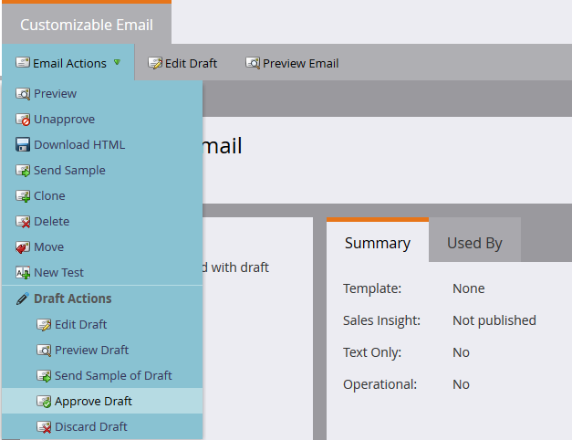
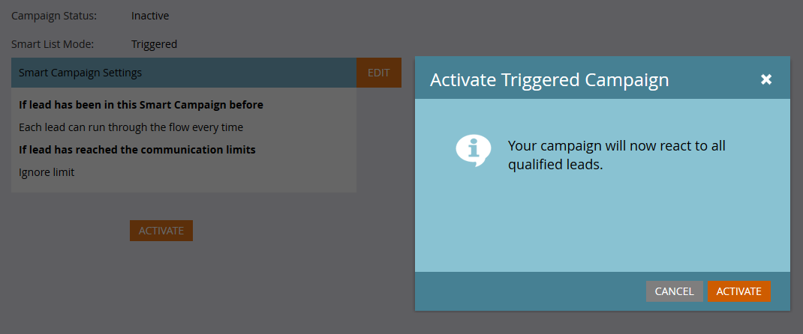
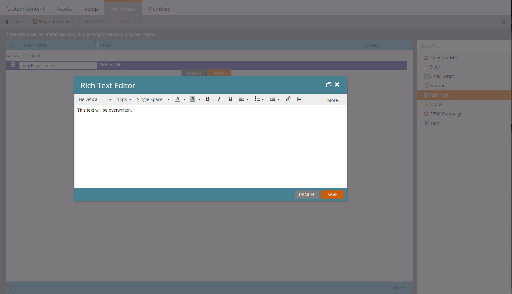

# Email transacional

Use a API [Solicitar Campanha](https://developer.adobe.com/marketo-apis/api/mapi#operation/triggerCampaignUsingPOST) para enviar emails transacionais para registros específicos do Marketo. Configure o email e acione a campanha antes de fazer a solicitação.

- Certifique-se de que o recipient tenha um registro Marketo.
- Crie e aprove um email transacional na instância do Marketo.
- Ative uma campanha de acionador que use &quot;A campanha é solicitada, 1. Source: API do serviço da Web&quot; e envia o email.

Primeiro, [crie e aprove o email](https://experienceleague.adobe.com/docs/marketo/using/home.html?lang=pt-BR). Se o email estiver legalmente qualificado como operacional, configure-o como operacional em Ações de email > Configurações de email:


Aprove o email antes de criar a campanha:



Se necessário, consulte [Criar uma nova Campanha Inteligente](https://experienceleague.adobe.com/docs/marketo/using/product-docs/core-marketo-concepts/smart-campaigns/creating-a-smart-campaign/create-a-new-smart-campaign.html?lang=pt-BR). Configure a Smart List da campanha com o acionador A campanha é solicitada:


Configure uma etapa do fluxo Enviar email que faça referência ao email transacional:


Antes da ativação, defina as configurações de qualificação na guia Schedule. Mantenha a configuração padrão se cada registro precisar receber o email apenas uma vez. Caso contrário, permita que os recipients se qualifiquem sempre ou em uma cadência disponível.

Ativar a campanha:



## Envio de chamadas de API

Os exemplos de Java usam o [pacote minimal-json](https://github.com/ralfstx/minimal-json) para lidar com representações JSON.

Antes de enviar o email, confirme se existe um registro Marketo para o endereço de email e recupere a ID do cliente potencial. Este exemplo pressupõe que o endereço de email já existe.

Use [Obter Clientes Potenciais por Tipo de Filtro](https://developer.adobe.com/marketo-apis/api/mapi#operation/getLeadsByFilterUsingGET) para recuperar a ID. O método principal a seguir solicita a campanha:

```java
package dev.marketo.blog_request_campaign;

import com.eclipsesource.json.JsonArray;

public class App
{
    public static void main( String[] args )
    {
        //Create an instance of Auth so that we can authenticate with our Marketo instance
        Leads leadsRequest = new Leads(auth).setFilterType("email").addFilterValue("requestCampaign.test@marketo.com");

        //Create and parameterize an instance of Leads
        //Set your email filterValue appropriately
        Leads leadsRequest = new Leads(auth).setFilterType("email").addFilterValue("test.requestCamapign@example.com");

        //Get the inner results array of the response
        JsonArray leadsResult = leadsRequest.getData().get("result").asArray();

        //Get the id of the record indexed at 0
        int lead = leadsResult.get(0).asObject().get("id").asInt();

        //Set the ID of your campaign from Marketo
        int campaignId = 0;
        RequestCampaign rc = new RequestCampaign(auth, campaignId).addLead(lead);

        //Send the request to Marketo
        rc.postData();
    }
}
```

Extraia a matriz de resultados da resposta `JsonObject` e recupere o objeto no índice 0:

```java
JsonArray leadsResult = leadsRequest.getData().get("result").asArray();
int leadId = leadsResult.get(0).asObject().get("id").asInt();
```

Campanha de solicitação de chamada com a ID da campanha no URL da solicitação. O corpo da solicitação contém uma matriz de objetos JSON com um membro `id`:

```java
package dev.marketo.blog_request_campaign;
import java.io.IOException;
import java.io.InputStream;
import java.io.InputStreamReader;
import java.io.OutputStreamWriter;
import java.io.Reader;
import java.net.MalformedURLException;
import java.net.URL;
import java.util.ArrayList;
import javax.net.ssl.HttpsURLConnection;
import com.eclipsesource.json.JsonArray;
import com.eclipsesource.json.JsonObject;

public class RequestCampaign {
    private String endpoint;
    private Auth auth;
    public ArrayList leads = new ArrayList();
    public ArrayList tokens = new ArrayList();

    public RequestCampaign(Auth auth, int campaignId) {
        this.auth = auth;
        this.endpoint = this.auth.marketoInstance + "/rest/v1/campaigns/" + campaignId + "/trigger.json";
    }
    public RequestCampaign setLeads(ArrayList leads) {
        this.leads = leads;
        return this;
    }
    public RequestCampaign addLead(int lead){
        leads.add(lead);
        return this;
    }
    public RequestCampaign setTokens(ArrayList tokens) {
        this.tokens = tokens;
        return this;
    }
    public RequestCampaign addToken(String tokenKey, String val){
        JsonObject jo = new JsonObject().add("name", tokenKey);
        jo.add("value", val);
        tokens.add(jo);
        return this;
    }
    public JsonObject postData(){
        JsonObject result = null;
        try {
            JsonObject requestBody = buildRequest(); //builds the Json Request Body
            System.out.println("Executing RequestCampaign call\n" + "Endpoint: " + endpoint + "\nRequest Body:\n"  + requestBody);
            URL url = new URL(endpoint);
            HttpsURLConnection urlConn = (HttpsURLConnection) url.openConnection(); //Return a URL connection and cast to HttpsURLConnection
            urlConn.setRequestMethod("POST");
            urlConn.setRequestProperty("Content-type", "application/json");
            urlConn.setRequestProperty("accept", "text/json");
            urlConn.setDoOutput(true);
            OutputStreamWriter wr = new OutputStreamWriter(urlConn.getOutputStream());
            wr.write(requestBody.toString());
            wr.flush();
            InputStream inStream = urlConn.getInputStream(); //get the inputStream from the URL connection
            Reader reader = new InputStreamReader(inStream);
            result = JsonObject.readFrom(reader); //Read from the stream into a JsonObject
            System.out.println("Result:\n" + result);
        } catch (MalformedURLException e) {
            e.printStackTrace();
        } catch (IOException e) {
            e.printStackTrace();
        }
        return result;
    }

    private JsonObject buildRequest(){
        JsonObject requestBody = new JsonObject(); //Create a new JsonObject for the Request Body
        JsonObject input = new JsonObject();
        JsonArray leadsArray = new JsonArray();
        for (int lead : leads) {
            JsonObject jo = new JsonObject().add("id", lead);
            leadsArray.add(jo);
        }
        input.add("leads", leadsArray);
        JsonArray tokensArray = new JsonArray();
        for (JsonObject jo : tokens) {
            tokensArray.add(jo);
        }
        input.add("tokens", tokensArray);
        requestBody.add("input", input);
        return requestBody;
    }

}
```

Essa classe tem um construtor que aceita um Auth e a Id da campanha. Clientes potenciais são adicionados ao objeto passando um `ArrayList<Integer>` contendo as Ids dos registros para setLeads ou usando addLead, que pega um inteiro e o anexa à ArrayList existente na propriedade de clientes potenciais. Para acionar a chamada de API para transmitir os registros de lead para a campanha, postData deve ser chamado, que retorna um JsonObject que contém os dados de resposta da solicitação. Quando a campanha de solicitação é chamada, cada lead transmitido para a chamada será processado pela campanha do acionador do target no Marketo e receberá o email criado anteriormente. Parabéns, você acionou um email por meio da API REST do Marketo. Fique atento à Parte 2, onde analisamos a personalização dinâmica do conteúdo de um email por meio da Campanha de solicitação.

### Criação do email

Para personalizar nosso conteúdo, primeiro devemos configurar um [programa](https://experienceleague.adobe.com/docs/marketo/using/product-docs/core-marketo-concepts/programs/creating-programs/create-a-program.html?lang=pt-BR) e um [email](https://experienceleague.adobe.com/docs/marketo/using/home.html?lang=pt-BR) no Marketo. Para gerar nosso conteúdo personalizado, devemos criar tokens dentro do programa e, em seguida, colocá-los no email que vamos enviar. Para simplificar, estamos usando apenas um token neste exemplo, mas você pode substituir qualquer número de tokens em um email, no campo Do email, Do nome, Responder para ou qualquer parte do conteúdo do email. Então, vamos criar um token de Rich Text para substituição e chamá-lo de &quot;bodyReplacement&quot;. O Rich Text permite substituir qualquer conteúdo no token pelo HTML arbitrário que queremos inserir.



Os tokens não podem ser salvos enquanto estiverem vazios. Continue e insira um texto de espaço reservado aqui. Agora precisamos inserir nosso token no email:


Agora esse token poderá ser substituído por meio de uma chamada Campanha de solicitação. Esse token pode ser tão simples quanto uma única linha de texto, que deve ser substituída por email ou pode incluir quase todo o layout do email.

### O Código

```java
package dev.marketo.blog_request_campaign;

import com.eclipsesource.json.JsonArray;

public class App
{
    public static void main( String[] args )
    {
        //Create an instance of Auth so that we can authenticate with our Marketo instance
        Auth auth = new Auth("Client ID - CHANGE ME", "Client Secret - CHANGE ME", "Host - CHANGE ME");

        //Create and parameterize an instance of Leads
        Leads leadsRequest = new Leads(auth).setFilterType("email").addFilterValue("requestCampaign.test@marketo.com");

        //get the inner results array of the response
        JsonArray leadsResult = leadsRequest.getData().get("result").asArray();

        //get the id of the record indexed at 0
        int lead = leadsResult.get(0).asObject().get("id").asInt();

        //Set the ID of our campaign from Marketo
        int campaignId = 1578;
        RequestCampaign rc = new RequestCampaign(auth, campaignId).addLead(lead);

        //Create the content of the token here, and add it to the request
        String bodyReplacement = "<div class=\"replacedContent\"><p>This content has been replaced</p></div>";
        rc.addToken("{{my.bodyReplacement}}", bodyReplacement);
        rc.postData();
    }
}
```

Se o código parece familiar, isso ocorre porque ele tem apenas duas linhas adicionais do método principal acima. Desta vez, estamos criando o conteúdo de nosso token na variável bodyReplacement e usando o método addToken para adicioná-lo à solicitação. O addToken pega uma chave e um valor, cria uma representação JsonObject e a adiciona à matriz de tokens interna. Isso é serializado durante o método postData e cria um corpo com esta aparência:

```json
{
    "input":
    {
        "leads": [
            {
                "id": 1
            }
        ],
        "tokens": [
            {
                "name": "{{my.bodyReplacement}}",
                "value": "<div class=\"replacedContent\"><p>This content has been replaced</p></div>"
            }
        ]
    }
}
```

Combinada, nossa saída do console fica assim:

```bash
Token is empty or expired. Trying new authentication
Trying to authenticate with ...
Got Authentication Response: {"access_token":"19d51b9a-ff60-4222-bbd5-be8b206f1d40:st","token_type":"bearer","expires_in":3565,"scope":"apiuser@mktosupport.com"}
Executing RequestCampaign call
Endpoint: .../rest/v1/campaigns/1578/trigger.json
Request Body:
{"input":{"leads":[{"id":1}],"tokens":[{"name":"{{my.bodyReplacement}}","value":"<div class=\"replacedContent\"><p>This content has been replaced</p></div>"}]}}
Result:
{"requestId":"1e8d#14eadc5143d","result":[{"id":1578}],"success":true}
```

## Encapsulamento

Esse método é extensível de várias maneiras, alterando o conteúdo de emails em seções de layout individuais ou emails externos, permitindo que valores personalizados sejam passados para tarefas ou momentos interessantes. Em qualquer lugar que um token possa ser usado em um programa, ele pode ser personalizado usando esse método. Uma funcionalidade semelhante também está disponível com a chamada [Programar Campanha](https://developer.adobe.com/marketo-apis/api/mapi#operation/scheduleCampaignUsingPOST), que permitirá processar tokens em uma campanha em lote inteira. Eles não podem ser personalizados com base no cliente potencial, mas são úteis para personalizar o conteúdo em um amplo conjunto de clientes potenciais.
