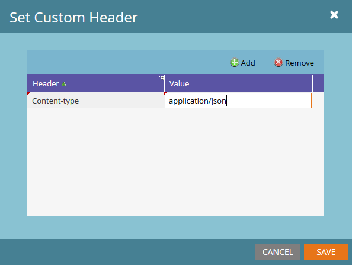

# Webhooks

Os webhooks do Marketo se comunicam com serviços da Web de terceiros. Um webhook usa o verbo HTTP GET ou POST para enviar ou recuperar dados de um URL específico.

Para obter instruções sobre como criar um webhook e adicioná-lo a uma Campanha Inteligente, consulte:

- [Criar um webhook](https://experienceleague.adobe.com/en/docs/marketo/using/product-docs/administration/additional-integrations/create-a-webhook)
- [Chamar webhook](https://experienceleague.adobe.com/en/docs/marketo/using/product-docs/core-marketo-concepts/smart-campaigns/flow-actions/call-webhook)
- [Usar um webhook em uma campanha inteligente](https://experienceleague.adobe.com/en/docs/marketo/using/product-docs/core-marketo-concepts/smart-campaigns/flow-actions/use-a-webhook-in-a-smart-campaign)

Configure cada webhook com estas propriedades:

- **[!UICONTROL URL]** - A URL para a qual você envia a solicitação de serviço Web.
- **[!UICONTROL Tipo de Solicitação]** - O método HTTP.
- **[!UICONTROL Modelo de carga]** - O modelo para informações enviadas no corpo da POSTAGEM. Use qualquer formato de dados compatível com HTTP POST, incluindo XML, JSON ou SOAP. O formato de serialização deve permitir aspas duplas em cadeias de caracteres. Para inserir um token, selecione **[!UICONTROL Inserir Token]**. O Marketo delimita automaticamente os tokens do tipo sequência de caracteres em aspas duplas.
- **[!UICONTROL Codificação do token de solicitação]** - O formato de solicitação, JSON ou Form/Url, usado para codificar valores de token que incluem caracteres especiais, como um E comercial (&amp;). Selecione a codificação de corpo correta para que o webhook se comunique corretamente com o serviço da Web.
- **[!UICONTROL Tipo de resposta]** - O formato de resposta, JSON ou XML. Selecione o tipo correto para mapear propriedades de resposta a campos de cliente potencial no Marketo.
- **[!UICONTROL Cabeçalhos Personalizados]** - Pares de Valores-Chave adicionados como Cabeçalhos HTTP por meio de **[!UICONTROL Ações de Webhooks]** > **[!UICONTROL Definir Cabeçalho Personalizado]**. É possível adicionar qualquer número de cabeçalhos personalizados.

Use [Mapeamentos de Resposta](response-mappings.md) para gravar dados de respostas do serviço Web em clientes potenciais.

## Tokens

Todos os campos de webhook de saída, incluindo URL, Modelo e Cabeçalhos personalizados, preenchem o conteúdo do token no mesmo contexto da etapa de fluxo.

Os tokens de Cliente Potencial e Sistema estão sempre disponíveis. Os tokens de Acionador, Campanha e Programa estão disponíveis nos respectivos escopos. Para obter mais informações, consulte:

- [Visão geral de tokens](https://experienceleague.adobe.com/en/docs/marketo/using/product-docs/demand-generation/landing-pages/personalizing-landing-pages/tokens-overview)
- [Glossário de tokens do sistema](https://experienceleague.adobe.com/en/docs/marketo/using/product-docs/email-marketing/general/using-tokens/system-tokens-glossary)
- [Tokens de momentos interessantes](https://experienceleague.adobe.com/en/docs/marketo/using/product-docs/marketo-sales-insight/msi-for-salesforce/features/tabs-in-the-msi-panel/interesting-moments/trigger-tokens-for-interesting-moments)

Por exemplo, quando um Programa ou Campanha é mapeado para um recurso de terceiros, defina uma ID no nível do Programa como `My Token`. Em seguida, transmita a ID para a solicitação do webhook como um token.

## Cabeçalhos personalizados

Os webhooks podem enviar qualquer número de campos de Cabeçalho personalizado com uma solicitação de saída. Adicione cabeçalhos por meio de **[!UICONTROL Ações de Webhooks]** > **[!UICONTROL Definir Cabeçalho Personalizado]**.

Cada cabeçalho é um par de valor-chave e pode conter tokens.

## Dicas

- Use a etapa de fluxo Webhook de chamada somente em campanhas de acionador.
- Os mapeamentos de resposta atualizam um registro somente quando o serviço da Web retorna um código de resposta HTTP 2xx.
- Você pode usar os serviços da Web para executar enriquecimento, validação ou normalização de dados personalizados a partir de serviços internos ou externos.
- O tempo de execução do Webhook depende do tempo de resposta do serviço e pode causar longos atrasos de execução da campanha. Mesmo que um serviço leve apenas 50 ms para ser executado, 100.000 execuções levam 1,5 hora.
- O Marketo aguarda até 30 segundos por uma determinada chamada de serviço antes de encerrar a chamada (também conhecido como tempo limite).
- O Marketo passa caracteres no campo URL como escritos. Por exemplo, &#39;&amp;&#39; é enviado como &#39;&amp;&#39; e &#39;%26&#39; é enviado como &#39;%26&#39;.
  - Para enviar um caractere codificado por porcentagem para o servidor do recipient, passe explicitamente a cadeia de caracteres que representa esse caractere.
